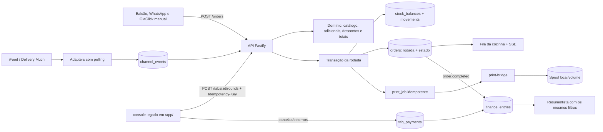

# Camoburguer Demo — Mapa do Projeto

Nota de entrada da documentação. Leia este arquivo primeiro para se orientar
no repositório antes de editar código ou documentos.

## Fluxo operacional

## Status atual (2026-07-21)

**Demo local:** aprovada — 36/36 testes, smoke E2E com quatro origens.  
**Integrações iFood/Delivery Much:** adapters implementados atrás de feature flags, sem homologação real.  
**Produção:** bloqueada — autenticação de operador, migrations versionadas, sandbox e impressão física são gates obrigatórios.

## Documentos por objetivo

| Arquivo | Conteúdo |
|---|---|
| [trilha-desenvolvimento.md](docs/trilha-desenvolvimento.md) | **Plano de Execução (Roadmap).** Entregas, gates e marcos. |
| [contexto-operacional.md](docs/contexto-operacional.md) | Atores, responsabilidades, objetivo da demo |
| [arquitetura-do-sistema.md](docs/arquitetura-do-sistema.md) | Apps, tabelas, fronteiras, modelo de persistência |
| [ciclo-do-pedido.md](docs/ciclo-do-pedido.md) | Estados, comandas, vínculo tardio, regras |
| [ciclo-financeiro.md](docs/ciclo-financeiro.md) | Caixa, lançamentos, visões gerenciais, timezone |
| [estoque.md](docs/estoque.md) | Categorias v1, fluxo de baixa, auditoria |
| [pagamentos-comandas.md](docs/pagamentos-comandas.md) | Parcelas, estornos, encerramento de comanda |
| [canais-e-captura.md](docs/canais-e-captura.md) | Fontes de pedido, estado das integrações |
| [padrao-ticket-cozinha.md](docs/padrao-ticket-cozinha.md) | Contrato do ticket — atualizar antes do código |
| [automacoes-por-cenario.md](docs/automacoes-por-cenario.md) | Gatilhos automáticos e regras de cenário |
| [guia-de-desenvolvimento.md](docs/guia-de-desenvolvimento.md) | Ambiente, gates de qualidade, invariantes, Graphify |
| [deploy-e-infraestrutura.md](docs/deploy-e-infraestrutura.md) | Render, variáveis, roteiro demo→produção |
| [historico-evolucao.md](docs/historico-evolucao.md) | 5W2H PRs 0–18, auditoria commit a commit |
| [relatorio-validacao.md](docs/relatorio-validacao.md) | Gates executados com evidências |
| [DESIGN.md](docs/DESIGN.md) | Tokens CSS, tipografia, layout, acessibilidade |
| [CAMOBURGUER_DOCS.md](docs/CAMOBURGUER_DOCS.md) | Índice de referência e invariantes em uma página |
| [operacao/runbook-duplicatas.md](docs/operacao/runbook-duplicatas.md) | Runbook para múltiplos caixas abertos |

## Arquivos de governança

| Arquivo | Conteúdo |
|---|---|
| [AGENTS.md](AGENTS.md) | Doutrina de agentes: Ponytail, m1nd, Graphify, boundaries |
| [SUBAGENTES.md](SUBAGENTES.md) | Papéis de revisão, blast radius, sequência de release |
| [README.md](README.md) | Setup técnico, gates locais, problemas comuns |

## Skills e workflows

- [`skills/`](skills/) — 18 skills: uma por papel de maker/gate-reviewer
- [`workflows/`](workflows/) — fluxo de implementação e template de review
- [`specs/`](specs/) — especificações de implementação por issue
- [`docs/specs/`](docs/specs/) — specs consolidadas de auditoria
- [`docs/prompts-remediacao-seguranca/`](docs/prompts-remediacao-seguranca/) — 17 prompts de remediação

## Convenção do vault

- Todo arquivo novo em `docs/` leva `tags:` no frontmatter YAML.
- Todo arquivo `docs/` termina com seção **Ver também** linkando de volta para este mapa.
- Docs de domínio complexo têm duas seções obrigatórias: **Guia de uso** e **Guia de desenvolvimento**.
- Nomes de arquivo em `kebab-case` PT-BR sem artigos.
- Cada informação vive em um único arquivo — os outros remetem por link, sem duplicar.
- Decisões registradas com data, **Trava**, **Pendente** ou **Aceito conscientemente**.
