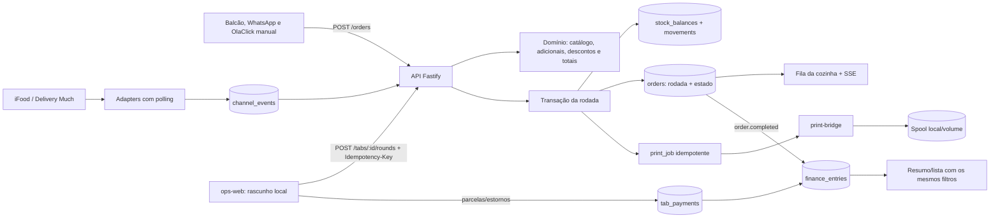

# Documentação Central - Camoburguer

Este documento contém toda a especificação, arquitetura, rotinas operacionais e relatórios de auditoria do sistema Camoburguer Demo.

---

## 5W2H EVOLUCAO

### Registro 5W2H da Evolução Operacional

Este documento usa What, Why, Where, When, Who, How e How much como registro decisório vivo. “How much” mede superfície técnica e operacional; nenhum custo financeiro é inventado.

#### PR 0 — Descontos por item e pedido

| Pergunta | Resposta |
| --- | --- |
| What | Descontos percentuais digitáveis de 0 a 100 por item e no total do pedido. |
| Why | Permitir promoções explícitas sem alterar preços do catálogo ou calcular valores fora do domínio. |
| Where | Domínio, tabela `orders`, API, formulário operacional, testes e ciclos de pedido/financeiro. |
| When | No cálculo do carrinho e na criação imutável do pedido. |
| Who | Operador informa; domínio valida; API persiste; revisor prova limites e total. |
| How | Desconto da linha antes do desconto geral, ambos normalizados e limitados por validação e constraint. |
| How much | Uma coluna aditiva, dois campos nativos, nenhum serviço ou dependência nova. |

**Critérios de aceite:** campos visíveis de 0 a 100; desconto da linha calculado antes do geral; valores inválidos rejeitados; persistência e reload preservados.

**Evidências:** 13 testes automatizados aprovados; `calculateOrderTotal()` ligado a `normalizeDiscountPercent()` no grafo; revisão peer-to-peer sem P0/P1.

**Riscos:** arredondamento monetário e divergência entre frontend e domínio. Mitigação: domínio como fonte final e normalização compartilhada.

**Rollback:** ocultar os campos e manter percentuais em zero; a coluna aditiva permanece sem exigir perda ou reescrita de dados.

#### PR 1 — Guia de desenvolvimento, 5W2H e Graphify

| Pergunta | Resposta |
| --- | --- |
| What | Guia único de desenvolvimento, registro 5W2H, comandos WSL e fluxo RAG/cache. |
| Why | Tornar a evolução reproduzível, reduzir contexto repetido e eliminar a falha do Graphify no host Windows. |
| Where | Documentação raiz, scripts npm e relatório de validação. |
| When | Antes das features de catálogo, comandas, estoque e pagamentos. |
| Who | Orquestrador mantém; makers aplicam; reviewers verificam evidências. |
| How | Prefixo estável de prompt, recuperação m1nd/Graphify e execução do Graphify pelo runtime Linux do WSL. |
| How much | Dois documentos novos, pequenos ajustes em README/package e nenhuma dependência de produção. |

**Critérios de aceite:** comandos executáveis no host; Graphify atualizado pelo WSL; guia cobre Git, testes, review e rollback; toda PR recebe 5W2H completo.

**Evidências:** 13 testes aprovados; `npm run graph:update` concluído no Ubuntu; grafo JSON válido com 374 nós e 474 arestas; consulta estrutural respondida.

**Riscos:** Graphify ausente no WSL e interpretação incorreta de `built_at_commit`. Mitigação: pré-requisito/probe explícito e freshness composta por manifesto, consulta e árvore limpa.

**Rollback:** restaurar scripts npm anteriores; documentos continuam válidos como histórico sem afetar aplicação ou banco.

#### Próximos incrementos

Cada PR adicionará aqui sua tabela 5W2H concluída, critérios de aceite, evidências, riscos e rollback antes do commit final.

#### PR 2 — Cardápio OlaClick

| Pergunta | Resposta |
| --- | --- |
| What | Snapshot estático do cardápio público, com categorias, preços, disponibilidade e mapeamento de estoque. |
| Why | Evitar preços fictícios na operação e manter a demo alinhada à oferta atual. |
| Where | Pacote de domínio, endpoint `/catalog`, seletor do frontend e testes. |
| When | Carregado na abertura da operação; atualização futura exige novo snapshot versionado. |
| Who | Fonte pública fornece; domínio versiona; API entrega; operador seleciona apenas disponíveis. |
| How | Lista local capturada em 2026-07-16, agrupada por `optgroup`, sem scraper ou chamada externa em runtime. |
| How much | Um arquivo de dados, pequenos ajustes em três consumidores e nenhuma dependência nova. |

**Critérios de aceite:** 51 registros, 50 disponíveis, “Produto 19” bloqueado no frontend e domínio, snapshot integral protegido por hash e origem/data verificáveis.

**Evidências:** teste de contrato e hash do catálogo, rejeição do indisponível, cobertura de optgroup/esgotado, consulta Graphify e endpoint `/catalog` no smoke integrado.

**Riscos:** mudança posterior do menu público. Mitigação: `capturedAt` e URL explícitos; nova captura entra por PR própria.

**Rollback:** restaurar o catálogo anterior sem migração de banco; pedidos existentes preservam seus próprios snapshots.

#### PR 3 — Adicionais do cardápio

| Pergunta | Resposta |
| --- | --- |
| What | Dezessete adicionais selecionáveis para Lanches, Xis e Dogs, com snapshot e preço. |
| Why | Permitir personalização cobrada sem depender de texto livre ou alterar o produto-base. |
| Where | Catálogo/domínio, `/catalog`, carrinho, pedido, ticket e testes. |
| When | Selecionados antes de adicionar ao rascunho e congelados ao criar o pedido. |
| Who | Operador escolhe; domínio valida/preça; cozinha recebe; financeiro reconhece no total. |
| How | Checkboxes nativos, SKU único por adicional e cálculo por unidade antes dos descontos. |
| How much | Uma lista estática e alterações localizadas, sem tabela, serviço ou dependência nova. |

**Critérios de aceite:** múltiplos adicionais distintos, bloqueio de duplicado/inválido, bebidas sem adicionais, total correto e ticket legível.

**Evidências:** hash dos 17 adicionais, testes de domínio/UI, `/catalog`, Graphify atualizado e smoke integrado.

**Riscos:** combinações visualmente iguais acumuladas de forma indevida. Mitigação: chave do carrinho inclui SKUs dos adicionais.

**Rollback:** ocultar checkboxes e rejeitar arrays novos; pedidos existentes preservam snapshots e totais já calculados.

#### PR 4 — Comandas livres

| Pergunta | Resposta |
| --- | --- |
| What | Comandas ou mesas abertas por identificador livre, com rodadas vinculadas ao núcleo de pedidos. |
| Why | Atender consumo local sem misturar rascunho comercial com canais externos ou exigir mapa fixo. |
| Where | PostgreSQL, API `/tabs`, carrinho existente, tela Comandas, ticket e testes. |
| When | Comanda abre antes do consumo; cada envio cria a próxima rodada sequencial. |
| Who | Operador abre/seleciona; API serializa; domínio cria pedido; cozinha recebe ticket. |
| How | `service_tabs`, vínculo opcional em `orders`, índice de identificador aberto e Idempotency-Key. |
| How much | Uma tabela, duas colunas em pedidos e reaproveitamento integral do formulário atual. |

**Critérios de aceite:** identificador livre único entre abertas, tab/mesa, rodada idempotente, total agregado e canais externos inalterados.

**Evidências:** testes de domínio/UI, smoke de abrir/lançar/repetir/consultar, Graphify e suíte completa.

**Riscos:** dois terminais criarem a mesma rodada. Mitigação: lock da comanda, índice `(tab_id, round_number)` e chave idempotente.

**Rollback:** desabilitar rotas/tela; pedidos já vinculados continuam pedidos válidos e o vínculo aditivo pode permanecer.

#### PR 5 — Rodadas e tickets corretivos

| Pergunta | Resposta |
| --- | --- |
| What | Cancelamento parcial/total de itens enviados por nova rodada negativa e ticket corretivo. |
| Why | Permitir editar uma comanda em andamento sem reescrever a informação já recebida pela cozinha. |
| Where | `orders`, domínio, endpoint de cancelamento, telas Comandas/Cozinha, ticket e testes. |
| When | Após o envio; antes do envio a edição continua ocorrendo no carrinho. |
| Who | Operador solicita; API valida saldo cancelável; cozinha executa o ticket corretivo. |
| How | IDs estáveis por linha, referência à rodada original, lock, Idempotency-Key e total negativo. |
| How much | Duas colunas em `orders`, uma rota, um diálogo e nenhuma tabela/serviço adicional. |

**Critérios de aceite:** original imutável, parcial limitado ao restante, retry sem duplicar, total da comanda compensado e cozinha destacada.

**Evidências:** testes de domínio/UI, smoke de criar/repetir/consultar/fechar, spool e Graphify.

**Riscos:** cancelamento exceder quantidade original. Mitigação: soma transacional dos corretivos existentes sob lock da comanda.

**Rollback:** desabilitar nova rota; corretivos existentes continuam pedidos auditáveis e seus totais permanecem no agregado.

#### PR 6 — Estoque por categoria

| Pergunta | Resposta |
| --- | --- |
| What | Saldos e movimentações auditáveis de Xis, Dog e Hambúrguer. |
| Why | Baixar automaticamente o que foi enviado à cozinha e impedir venda sem unidade disponível. |
| Where | PostgreSQL, domínio, criação/cancelamento de pedidos, `/inventory`, frontend e smoke. |
| When | Baixa na confirmação; restituição só em cancelamento anterior ao preparo; ajuste manual a qualquer momento autorizado. |
| Who | Operador inicializa/ajusta; API bloqueia e movimenta; domínio agrega categorias. |
| How | Locks por categoria, transação única, constraints e efeitos idempotentes append-only. |
| How much | Duas tabelas, uma tela/rota de ajuste e nenhuma gestão de ingredientes ou dependência nova. |

**Critérios de aceite:** zero inicial, `5-2=3` uma vez, insuficiência 409, reversão antes do preparo, ausência de reversão depois e motivo obrigatório.

**Evidências:** testes de agregação/UI, smoke com carga/retry/baixa/insuficiência/reversões, Docker WSL e Graphify.

**Riscos:** deadlock entre categorias e dupla baixa. Mitigação: ordem alfabética de locks e unicidade por efeito.

**Rollback:** bloquear novos itens controlados ou desabilitar a baixa; saldos/movimentos existentes permanecem para auditoria.

#### PR 7 — Pagamentos múltiplos

| Pergunta | Resposta |
| --- | --- |
| What | Parcelas com métodos distintos, saldo exato em centavos, estorno append-only e encerramento somente após quitação. |
| Why | Permitir dividir o consumo real de mesas/comandas sem perder a forma de cada recebimento ou distorcer o caixa. |
| Where | PostgreSQL, agregado `service_tabs`, API, frontend de comandas, financeiro, testes e documentação. |
| When | Depois das rodadas/correções e antes do encerramento comercial; cozinha segue ciclo independente. |
| Who | Operador registra/estorna; API serializa e valida; financeiro recebe um lançamento por parcela. |
| How | `amount_cents`, lock da comanda, `Idempotency-Key`, `tab_payments` append-only e vínculo em `finance_entries`. |
| How much | Uma tabela, duas colunas de vínculo financeiro, dois endpoints, UI embutida e nenhuma dependência ou serviço novo. |

**Critérios de aceite:** R$ 100 = Pix R$ 30 + débito R$ 70, excesso 409, R$ 99,99 mantém aberta, métodos preservados, dinheiro altera caixa e estorno não apaga o original.

**Evidências:** testes de domínio/UI, migração PostgreSQL existente, smoke Docker/WSL, lançamentos por parcela e Graphify.

**Riscos:** overpayment concorrente, arredondamento e estorno duplicado. Mitigação: centavos inteiros, lock da comanda e índices únicos.

**Rollback:** bloquear novas parcelas e manter `tab_payments`/`finance_entries` para conciliação; não apagar histórico antes de zerar comandas abertas.

#### PR 8 — Retirada e filtros financeiros

| Pergunta | Resposta |
| --- | --- |
| What | Expor `withdrawal` como “Retirada (sangria)” e filtrar financeiro por método e tipo. |
| Why | Tornar a retirada encontrável e impedir divergência entre lançamentos exibidos, cards e totais filtrados. |
| Where | Tela financeira, consumo dos endpoints existentes, smoke, documentação e Graphify. |
| When | Durante consulta gerencial ou movimentação de um turno aberto. |
| Who | Operador seleciona/limpa; API aplica filtros; frontend renderiza um único conjunto coerente. |
| How | `URLSearchParams` compartilhado simultaneamente por `/finance/entries` e `/finance/summary`; `withdrawal` permanece o tipo canônico. |
| How much | Dois controles, um botão de limpeza e ajustes locais de UI/testes; sem tabela, endpoint, dependência ou serviço novo. |

**Critérios de aceite:** retirada reduz caixa e não faturamento; filtro Pix mostra só Pix; combinação tipo/método recalcula lista e cards; limpar restaura o consolidado.

**Evidências:** testes DOM, suíte financeira, smoke Docker/WSL e consulta Graphify.

**Riscos:** aplicar filtro apenas na lista. Mitigação: uma string de query criada no `refreshAll` e reutilizada nos dois endpoints.

**Rollback:** remover os controles e voltar a buscar endpoints sem query; lançamentos e tipos persistidos não mudam.

#### PR 9 — QA, documentação e release

| Pergunta | Resposta |
| --- | --- |
| What | Consolidar documentação, automatizar a atualização segura do Graphify no WSL, executar regressão integrada e corrigir o overflow descoberto na inspeção móvel. |
| Why | Encerrar a pilha com evidência reproduzível e impedir que um release funcional no desktop permaneça impraticável no atendimento por tela estreita. |
| Where | README, arquitetura, contexto, automações, guia, relatório, Graphify, CSS do `ops-web` e teste de regressão. |
| When | Depois de todos os incrementos funcionais e antes de promover as PRs empilhadas para revisão pronta. |
| Who | Maker consolida e executa; navegador prova a experiência; reviewer distinto decide o go/no-go; mantenedor integra a pilha na ordem. |
| How | Suíte completa, build/compose no WSL, healthchecks estáveis, smoke, inspeção desktop/390 px, correção mínima, Graphify em staging Linux e peer review final. |
| How much | Um script de desenvolvimento, uma regra CSS localizada, um teste adicional e atualização de seis documentos; sem schema, serviço, dependência ou custo financeiro novo. |

**Critérios de aceite:** 30 testes verdes; smoke completo em banco migrado; quatro containers ativos; pedidos, comandas, estoque, cozinha e financeiro inspecionados; filtro Pix coerente; viewport de 390 px sem overflow do documento; grafo atualizado e consulta nova respondida.

**Evidências:** `npm test` 30/30; Docker/WSL saudável; smoke final em 22,5 s; console do navegador sem erro/aviso; `scrollWidth` 375 em viewport de 390 px; revisão visual desktop e móvel; atualização Graphify pelo script versionado.

**Riscos:** a recriação sequencial dos containers pode deixar healthchecks antigos responderem enquanto o Compose ainda substitui a API. Mitigação: exigir todos os serviços saudáveis e estáveis por 15 segundos antes do smoke.

**Rollback:** reverter CSS/teste/script/documentos desta PR sem tocar nos dados ou nas features anteriores; se o Graphify deixar de atualizar, os artefatos da branch-base continuam utilizáveis como snapshot até nova reconstrução.
#### PR 10 — Integração iFood e Delivery Much (Fase 1: Schema e Status)

| Pergunta | Resposta |
| --- | --- |
| What | Tabelas channel_mappings, channel_events, channel_commands e fluxo de estados independentes (sync_status) para canais externos. |
| Why | Isolar a máquina de estados de canais externos do núcleo de pedidos, permitindo enfileirar recebimentos sem afetar estoque ou caixa prematuramente. |
| Where | Domínio (packages/shared-types), DB (pps/api/src/db.js), configurações, API e frontend (fila de autorização). |
| When | Durante o fluxo de eventos webhook/polling dos agregadores. |
| Who | API recebe e mapeia; operador visualiza em fila de autorização; frontend dispara aceitação. |
| How | Tabela de mapeamento 1:1, status apartados (ccept_pending, etc) e botões de Aceitar/Recusar na UI segregando responsabilidade. |
| How much | 3 novas tabelas (mappings, events, commands), 1 fila visual separada no frontend. |

**Critérios de aceite:** Pedidos externos caem com status=received e não reduzem estoque nem imprimem até o aceite manual. UI possui cards destacados para aceite.

**Evidências:** Criação de tabelas validadas por testes unitários, smoke tests end-to-end simulados e exibição correta na interface.

**Riscos:** Inconsistência entre status do integrador e status interno. Mitigação: Uso de chaves idempotentes e webhook event sourcing.

**Rollback:** Desativar a flag ENABLED nas variáveis de ambiente dos canais externos; os pedidos internos não são afetados.

#### PR 11 — Identidade Visual Premium (Black & Brown)

| Pergunta | Resposta |
| --- | --- |
| What | Redesign completo do frontend (ops-web) utilizando fundo negro profundo, acentos em marrom/caramelo e glassmorphism. |
| Why | Criar uma estética moderna, visualmente marcante ("wow factor") e adequada a ambientes de operação em baixa luminosidade (POS). |
| Where | CSS nativo (pps/ops-web/styles.css) e estrutura HTML (pps/ops-web/index.html). |
| When | Em todo carregamento da aplicação web. |
| Who | Usuários do caixa, balcão e gerência de operações. |
| How | Variáveis CSS remapeadas, introdução de opacidade, e emojis como micro-âncoras visuais nos formulários. |
| How much | Alteração integral do stylesheet e ajuste de responsividade com Flexbox, sem novas dependências. |

**Critérios de aceite:** UI deve parecer premium; formulários legíveis em monitores escuros; botões alinhados.

**Evidências:** Testes unitários corrigidos para mapear novos emojis, grid responsivo (lex-wrap) validado em resolução estreita.

**Riscos:** Contraste baixo para textos secundários. Mitigação: Uso de cores calculadas via HSL na raiz do CSS.

**Rollback:** Reversão do commit de CSS (styles.css); sem risco estrutural.

#### PR 12 — Impressão Client-side (Cozinha e Caixas)

| Pergunta | Resposta |
| --- | --- |
| What | Impressão de tickets de cozinha e relatórios de turno (resumido e detalhado) pelo navegador. |
| Why | Permitir demonstração tátil e fluida usando janelas nativas de impressão, abandonando spooling em arquivo. |
| Where | Função printOrderTicket, printShiftReport em main.js e regras de @media print no styles.css. |
| When | Ao disparar produção da cozinha, re-impressão, ou no fechamento do caixa. |
| Who | Operador comanda a ação e escolhe a impressora térmica instalada localmente no Windows. |
| How | Injeção de HTML num <div id="print-area"> escondendo o resto da UI via CSS durante a impressão; endereço incluído dinamicamente em delivery. |
| How much | Modificação focal de frontend sem dependência externa de spoolers complexos. |

**Critérios de aceite:** Apenas o layout monocromático text-only deve ser impresso; dados cruciais obrigatoriamente preenchidos.

**Evidências:** Interceptação pelo Windows Printer Dialog; resumo financeiro contabiliza Pix, Dinheiro, Sangrias corretamente no cupom.

**Riscos:** Incompatibilidade de larguras. Mitigação: Uso de tipografia monospace clássica.

**Rollback:** Remoção das funções client-side, voltando ao endpoint de dispatchPrintJob.

#### PR 13 — Documentação Central e Blueprint Render

| Pergunta | Resposta |
| --- | --- |
| What | Unificação de toda documentação técnica em guia mestre e criação do Blueprint `render.yaml` para deploy automatizado na nuvem. |
| Why | Eliminar fragmentação de documentação e habilitar deploy em 1 clique no Render PaaS para demonstrações e produção. |
| Where | `docs/DOCUMENTACAO_CENTRAL.md`, `docs/RENDER_DEPLOY.md`, `render.yaml` e `README.md`. |
| When | Após consolidação funcional completa (PRs 0-12) e antes do primeiro deploy em nuvem. |
| Who | Desenvolvedor consolida; Render provisiona automaticamente; stakeholder acessa a demo online. |
| How | Documento central com sumário executivo + diagrama Mermaid + tabelas 5W2H. Blueprint YAML com 4 serviços (DB, API, Bridge, Static). |
| How much | Três documentos novos/reescritos, um arquivo de infraestrutura como código. Sem dependência ou serviço novo. |

**Critérios de aceite:** Documentação central cobre todas as 12 PRs; `render.yaml` provisiona 4 serviços com variáveis corretas; README linkado.

**Evidências:** Deploy funcional no Render com banco provisionado automaticamente; 30 testes aprovados localmente.

**Riscos:** Divergência entre documentação e código. Mitigação: Docs gerados após implementação, revisados contra código.

**Rollback:** Reverter documentos sem afetar código funcional; `render.yaml` pode ser removido sem impactar operação local.

#### PR 14 — Fluxo Contínuo de Comandas e Desconto por Rodada

| Pergunta | Resposta |
| --- | --- |
| What | Carrinho dedicado na aba de comandas com catálogo modal integrado, edição de desconto por rodada já enviada e ordenação de pedidos (ativos primeiro). |
| Why | Permitir operação contínua sem alternar entre abas; dar flexibilidade de desconto pós-envio em cenários de promoção ou erro. |
| Where | `apps/ops-web/main.js`, `apps/ops-web/index.html`, endpoints existentes de `PATCH /orders/:id/discount`. |
| When | Na operação de lançamento de rodadas e na visualização de pedidos. |
| Who | Operador lança rodada com carrinho contextual; API valida e aplica desconto. |
| How | Carrinho renderizado dentro do card da comanda ativa; modal de catálogo reutilizado; pedidos ativos ordenados acima dos finalizados. |
| How much | Alterações focais em frontend e ajuste de rate limit para 1000 req/min no modo demo. Sem nova tabela ou dependência. |

**Critérios de aceite:** Carrinho de comanda funcional com catálogo; desconto editável em rodada já enviada; pedidos ordenados por status.

**Evidências:** Operação completa de comanda com rodadas consecutivas; testes visuais de ordenação; 30 testes aprovados.

**Riscos:** Conflito de merge com HTML em andamento. Mitigação: Remoção de marcadores de conflito e teste manual.

**Rollback:** Reverter commits de frontend; funcionalidade de rodada permanece pela API sem o carrinho contextual.

#### PR 15 — LGPD, Segurança e Hardening

| Pergunta | Resposta |
| --- | --- |
| What | Rota `/lgpd/anonymize` para anonimização de PII, headers de segurança via `@fastify/helmet` e rate limiting via `@fastify/rate-limit`. |
| Why | Atender requisitos de Lei Geral de Proteção de Dados e proteger a API contra abuso em ambiente público. |
| Where | `apps/api/src/server.js`, `apps/api/package.json`. |
| When | Em toda requisição HTTP (helmet/rate-limit) e sob demanda (anonimização). |
| Who | API aplica proteções automaticamente; operador/DPO executa anonimização quando necessário. |
| How | Plugins Fastify nativos registrados no boot; rota POST que substitui campos PII por hashes no banco. |
| How much | Três dependências de produção (`@fastify/cors`, `@fastify/helmet`, `@fastify/rate-limit`), uma rota nova. |

**Critérios de aceite:** Headers de segurança presentes nas respostas; rate limit ativo com resposta 429 após exceder; anonimização substitui nomes e endereços.

**Evidências:** Teste de headers via DevTools; rate limit confirmado com requisições em sequência; campos anonimizados no banco.

**Riscos:** Rate limit muito baixo para operação real. Mitigação: Configurável por variável de ambiente; 1000 req/min no modo demo.

**Rollback:** Remover registro dos plugins; rota de anonimização pode permanecer inerte sem afetar operação.

#### PR 16 — Refatoração UI: Catálogo por Abas e Configuração Modal

| Pergunta | Resposta |
| --- | --- |
| What | Interface do catálogo reorganizada em abas por categoria com modal de adicionais/desconto e compatibilidade retroativa (remoção de `Object.groupBy`). |
| Why | Melhorar a navegação em catálogos grandes (51 itens) e garantir funcionamento em navegadores mais antigos. |
| Where | `apps/ops-web/main.js`, `apps/ops-web/index.html`. |
| When | Na seleção de produtos para adicionar ao carrinho. |
| Who | Operador navega entre categorias; modal permite personalização antes de adicionar. |
| How | Tabs HTML nativas com event delegation; `reduce` manual substituindo `Object.groupBy`; modal `<dialog>` nativo. |
| How much | Refatoração focal de frontend; cache bust via query string no `main.js`. Sem nova dependência. |

**Critérios de aceite:** Catálogo agrupado por categorias com abas clicáveis; modal funcional com adicionais, desconto e observação; compatível com Chrome 110+.

**Evidências:** Operação testada em Chrome e Edge; `Object.groupBy` removido; cache invalidado.

**Riscos:** Event delegation pode conflitar com handlers existentes. Mitigação: Bubbling controlado com `closest()`.

**Rollback:** Reverter para listagem plana do catálogo sem abas; funcionalidade de pedido permanece intacta.

#### PR 17 — Correção de Render.yaml e Auto-Seed (histórico substituído)

| Pergunta | Resposta |
| --- | --- |
| What | Registro histórico da correção do Blueprint e de uma antiga tentativa de seed no boot, posteriormente removida. |
| Why | O Blueprint não provisionava o banco corretamente e o Render requer health check na rota raiz. |
| Where | `render.yaml`, `apps/api/src/server.js`. |
| When | No deploy via Render Blueprint. |
| Who | Render provisiona DB via Blueprint; seed exige hoje operação administrativa explícita. |
| How | Registro histórico: a implementação então usava seed no boot; esse comportamento foi removido pelo hardening abaixo. |
| How much | Correções mínimas em 2 arquivos; sem nova dependência. |

**Critérios de aceite históricos:** Blueprint provisiona banco PostgreSQL e health check na raiz retorna 200. Seed automático não é mais aceito.

**Evidências históricas:** `GET /` retornava 200; evidência de auto-seed foi invalidada pelo hardening.

**Risco encerrado:** inferir vazio por uma única tabela era destrutivo; o comportamento foi removido.

**Rollback histórico (não reutilizar):** a execução automática e o CLI direto foram
substituídos pela proteção descrita abaixo. Nenhum rollback pode reativar `AUTO_SEED`.

#### Hardening — seed de demo explícito

| Pergunta | Resposta |
| --- | --- |
| What | Remover seed do boot e proteger a carga demo por autenticação, ambiente, habilitação, alvo e confirmação. |
| Why | Preservar as 13 tabelas em boot, restart, falha e concorrência. |
| Where | Configuração da API/deploy, `/demo/seed`, CLI, testes, CI e runbooks. |
| When | Somente por operação administrativa explícita em banco demo baseline. |
| Who | Mantenedor autenticado configura e confirma o alvo sanitizado. |
| How | Uma transação resolve o alvo, bloqueia as tabelas em ordem fixa, executa preflight e só então semeia. |
| How much | Mudança backend localizada, sem dependência de runtime ou schema novo. |

**Migração:** fixar `AUTO_SEED=false`, redeployar, validar boot sem seed e manter
`DEMO_SEED_ENABLED=false` fora da janela administrativa.

**Rollback:** reverter código somente com `AUTO_SEED=false` e
`DEMO_SEED_ENABLED=false`; nunca restaurar auto-seed ou CLI com acesso direto ao banco.
O commit de configuração `f3191d3` deve permanecer aplicado em qualquer rollback.

#### PR 18 — Correção de apiBase para Deploy Render

| Pergunta | Resposta |
| --- | --- |
| What | Correção da lógica de `apiBase` no frontend para apontar para o subdomínio correto da API no Render (`camoburguer-api.onrender.com`) em vez do site estático. |
| Why | O frontend em produção tentava chamar a API no mesmo hostname do site estático (ops-web), resultando em 404 "Not Found" em todas as rotas. |
| Where | `apps/ops-web/main.js`, constante `apiBase`. |
| When | No carregamento da SPA em ambiente de produção no Render. |
| Who | Frontend detecta automaticamente o ambiente e ajusta a URL. |
| How | Substituição dinâmica: `hostname.replace('ops-web', 'api')` para produção; `:3001` mantido para localhost. |
| How much | Alteração de 3 linhas em 1 arquivo. Sem dependência nova. |

**Critérios de aceite:** `apiBase` resolve para `https://camoburguer-api.onrender.com` em produção e `http://localhost:3001` localmente; todas as chamadas retornam 200.

**Evidências:** Logs do Render mostram requisições bem-sucedidas na API; frontend conecta e exibe "API conectada".

**Riscos:** Hostnames de Render customizados não seguem o padrão `ops-web`/`api`. Mitigação: Funciona com o naming padrão do Blueprint; domínios customizados precisariam de variável de ambiente.

**Rollback:** Reverter para URL hardcoded; configurar `API_BASE_URL` como variável de ambiente se necessário.


---

## ARQUITETURA DO SISTEMA

### Arquitetura do Sistema

`service_tabs` é o agregado comercial de consumo local. `orders` permanece o núcleo operacional e representa cada rodada enviada à cozinha; o vínculo é opcional para preservar os quatro canais externos. O frontend reutiliza o mesmo carrinho e apenas troca o endpoint de confirmação quando existe comanda ativa.

`catalog_items` materializa uma vez o snapshot base e passa a ser a fonte operacional para pedidos manuais. Alterações não reescrevem linhas já congeladas em `orders`. `order_tab_assignments` registra de forma append-only e idempotente o vínculo tardio de um pedido local com uma comanda, sem criar outro pedido ou efeito de impressão.

`stock_balances` guarda o estado mínimo das três categorias e `stock_movements` guarda a trilha append-only. A baixa faz parte da mesma transação que cria `orders` e `print_jobs`, portanto a cozinha nunca recebe ticket de item sem saldo confirmado.

`tab_payments` compõe o saldo financeiro da comanda em centavos e preserva parcelas/estornos como eventos append-only. Cada parcela gera um `finance_entries` ligado por `tab_id` e `payment_id`; somente dinheiro atualiza o esperado do turno. O ciclo financeiro da comanda é independente do ciclo de preparo das rodadas.

#### Apps

- `apps/api`: núcleo HTTP, domínio, persistência, SSE e automações
- `apps/ops-web`: interface operacional leve
- `apps/print-bridge`: bridge de impressão com spool em arquivo
- `apps/event-simulator`: cenário HTTP autenticado e restrito a ambiente local/efêmero

#### Outbox de integrações

Comandos externos são persistidos antes do HTTP. Workers fazem claim com
`FOR UPDATE SKIP LOCKED`, `lease_owner` e expiração; o HTTP ocorre fora da
transação. A máquina usa `pending -> processing -> awaiting_event/completed`,
com `ambiguous` para qualquer resultado possivelmente aplicado e
`dead_letter` após três reconciliações inconclusivas. Só uma prova explícita
`not_applied` permite novo envio; respostas HTTP, inclusive 401, exigem
reconciliação antes de reenviar.

Crash antes do HTTP expira o lease e pode reenviar; crash depois do HTTP entra
em reconciliação pelo `correlation_id`, sem envio cego. A migração é aditiva e
preserva comandos históricos. Rollback de código mantém as colunas e deixa os
adapters desligados até que todos os estados não terminais sejam reconciliados.

Delivery Much permanece desabilitado por padrão. Os estados e fingerprints
atuais são comprovados apenas por fixtures locais; não constituem homologação
do contrato privado, sandbox ou produção do parceiro. Estado desconhecido ou
payload comercial divergente bloqueia ACK e exige reconciliação manual.

#### Packages

- `packages/shared-types`: enums e contratos compartilhados
- `packages/domain`: regras e transições de pedido e caixa
- `packages/finance-core`: lançamentos e agregações financeiras

#### Infra

- `docker compose`
- PostgreSQL
- volume de spool para impressão

#### Decisões

- núcleo único de pedidos
- frontend estático e leve
- backend em Node com Fastify
- finance gerencial e dirigido por evento
- adapters iFood/Delivery Much atrás de feature flags e ainda dependentes de homologação

#### Fluxo operacional obrigatório



- `Finalizar pedido` não limpa o carrinho antes de a API confirmar sucesso. Repetir a mesma finalização deve devolver o mesmo pedido, sem duplicar itens, impressão ou lançamento financeiro.
- O frontend não envia nem exibe operador: isso é uma limitação deliberada da demo e bloqueia o uso com dados reais até existir autenticação/autorização.
- `fulfillment` aceita apenas `delivery`, `pickup` e `local`. Endereço é obrigatório somente para `delivery` e deve ser ocultado/ignorado nos demais modos.
- A cozinha recebe somente pedidos confirmados. O horário impresso é o `createdAt` persistido no pedido, nunca o horário local da impressora.
- Rodadas de produção e cancelamento são novos `orders`; `reverses_order_id` referencia a origem, sem `UPDATE` destrutivo no ticket já emitido.
- A baixa de estoque, o pedido e o `print_job` compartilham a transação. Qualquer insuficiência aborta o conjunto inteiro.
- O saldo comercial da comanda deriva das rodadas menos cancelamentos e das parcelas menos estornos; nenhum total mutável paralelo é fonte de verdade.

#### Modelo de persistência consolidado

| Agregado/tabela | Responsabilidade | Regra de integridade principal |
| --- | --- | --- |
| `service_tabs` | identidade e ciclo comercial de comanda/mesa | um identificador normalizado por comanda aberta |
| `orders` | rodada de produção ou cancelamento | número sequencial por comanda e linhas estáveis |
| `stock_balances` | saldo corrente das três categorias | quantidade nunca negativa |
| `stock_movements` | auditoria de carga, ajuste, venda e reversão | efeito idempotente e vínculo ao pedido quando aplicável |
| `tab_payments` | parcelas e compensações em centavos | valor positivo, saldo não excedido e original preservado |
| `finance_entries` | livro gerencial de venda, caixa e pagamento | vínculo opcional a comanda/parcela e lançamento append-only |
| `print_jobs` | entrega recuperável do ticket | um job por efeito e spool idempotente |
| `catalog_items` | catálogo operacional derivado do snapshot base | SKU imutável, arquivamento lógico e classificação de preparo |
| `order_tab_assignments` | auditoria do vínculo tardio | uma atribuição por pedido e chave idempotente global |

#### Caixa

- A API é a fonte de verdade do estado do caixa: `closed -> open -> closed`.
- Abrir quando já existe caixa aberto e fechar caixa fechado são conflitos de estado; a UI apenas reflete essa regra e desabilita ações inválidas.
- Reforço e sangria são ajustes de um caixa aberto. O formulário pode ser um diálogo acionado por `Adicionar movimentação`; não constitui um módulo próprio.

#### Fronteiras e seams

- `apps/ops-web`: mantém somente estado efêmero de formulário/carrinho e apresenta estados vindos da API.
- `apps/api`: controla idempotência, transações, estado do caixa, confirmação e emissão de eventos.
- `packages/domain`: valida estados e invariantes puras de pedido e caixa.
- `packages/finance-core`: deriva lançamentos de eventos confirmados, sem depender da interface.
- `apps/print-bridge`: recebe o contrato estável do ticket e grava spool idempotente por `jobId`, sem consultar ou alterar pedidos. A API recupera jobs interrompidos na inicialização e repete falhas periodicamente.
- Reimpressão replica o conteúdo persistido no job original, inclusive após vínculo tardio com comanda.
- Novos canais entram por adapters que normalizam para o mesmo comando de pedido; não criam fluxos paralelos na UI ou no domínio.

#### Fronteira de integração externa

- `channel_events` deduplica o evento bruto do parceiro.
- `channel_mappings` liga merchant/pedido externo ao único `order` local e expõe estado de sincronização.
- `channel_commands` funciona como outbox de aceite, cancelamento, preparo e pronto.
- O poller usa advisory lock por canal para evitar duas execuções simultâneas.
- No iFood, persistência/processamento local fazem commit antes do ACK. Evento repetido é reconhecido e novamente confirmado sem duplicar pedido.
- Credenciais e payloads reais ainda não foram homologados. Feature flags devem permanecer desligadas fora de sandbox.

#### Fronteira de segurança

- CORS usa allowlist; isso controla navegador, não acesso à API.
- API e SSE usam sessão opaca em cookie `HttpOnly`, `Secure` e `SameSite=Strict`, com RBAC `admin`/`operator`/`kitchen` e CSRF vinculado à sessão.
- Seed e anonimização exigem sessão `admin`; o primeiro administrador é criado uma única vez por `ADMIN_BOOTSTRAP_PASSWORD`.
- API e print bridge usam `PRINT_BRIDGE_TOKEN`; o bridge valida bearer, IDs e tamanho do ticket.
- Rotas não classificadas falham fechadas e mutações autenticadas registram o identificador do ator em `audit_events`.

#### Eventos internos

- `order.created`, `order.confirmed`, `order.completed`, `order.cancelled`
- `order.tab.assigned`
- `catalog.changed` (`created`, `updated`, `paused`, `archived`)
- `ticket.printed`, `ticket.print.failed`
- `cash.shift.opened`, `cash.adjustment.created`, `cash.shift.closed`
- `finance.entry.created`

#### Riscos arquiteturais

- Finalização dividida em várias chamadas do frontend pode deixar pedido persistido sem confirmação/cozinha; a operação deve ser atômica na API.
- Confiar no estado do caixa mantido pela UI permite abertura duplicada e fechamento inválido; a restrição deve ser transacional no backend/DB.
- Gerar horário no print-bridge causa divergência entre operação e ticket; `createdAt` deve atravessar o contrato sem recomputação.
- Acoplar regras de delivery ou canal aos componentes visuais multiplica exceções; a UI coleta dados e a API valida o contrato normalizado.
- Hospedar o bridge no Render não alcança a impressora da LAN e o filesystem do serviço pode ser efêmero; produção exige um agente local autenticado.


---

## AUDITORIA COMMIT A COMMIT

### Auditoria commit a commit

Data da revisão: 2026-07-21. Universo: `git log --all`, 82 commits; 77 alcançáveis pelo `HEAD` `5c45a5c` e 5 somente em refs laterais. A análise combinou parentage, estatística, diff dos commits de risco, estado resultante e execução do código. “Corrigido” significa corrigido no working tree desta auditoria, ainda sem commit/deploy.

#### Fundação — 14 a 17 de julho

| # | Commit | Mudança | Auditoria e destino |
|---:|---|---|---|
| 1 | `3dd601b` | Inicialização do repositório | Base vazia/administrativa. Sem achado funcional isolado. |
| 2 | `bdd41dd` | Demo operacional completa | Criou 84 arquivos e 13.859 linhas de uma vez. Entregou a base funcional, mas o tamanho prejudicou revisão e concentrou API/UI; dívida permanece. |
| 3 | `9174d61` | Descontos por item e pedido | Regra útil preservada. Validação de 0–100 e ordem dos descontos continuam testadas. |
| 4 | `4be9594` | Guia de desenvolvimento e 5W2H | Instituiu governança, porém houve grande churn documental. Guia foi atualizado nesta auditoria para refletir os gates reais. |
| 5 | `cdeeabd` | Snapshot OlaClick 2026-07-16 | Fonte versionada e reproduzível. Continua válida como snapshot, não como catálogo online. |
| 6 | `5b00ef8` | Adicionais configuráveis | Modelo snapshot por linha foi preservado. Testes protegem duplicata, elegibilidade, preço e ticket. |
| 7 | `558ac72` | Comandas livres e rodadas | Boa consolidação: `service_tabs` comercial e `orders` operacional. Preservada. |
| 8 | `3d1125d` | Rodadas e tickets corretivos | Correção compensatória em vez de reescrita do ticket. Preservada e documentada. |
| 9 | `ea00965` | Estoque transacional | Regra forte, mas 3.701 adições/6.651 remoções indicam reescrita excessiva. Locks/rollback foram validados no smoke. |
| 10 | `38b122a` | Pagamentos múltiplos | Modelo em centavos e estornos é sólido; 8.087 adições/3.272 remoções novamente reduziram auditabilidade. Preservado. |
| 11 | `82019fc` | Sangria e filtros financeiros | Corrigiu semântica de faturamento e unificou filtro/lista/resumo. Preservado. |
| 12 | `b901fd4` | Consolidação de QA/release | Evidência era válida para aquele baseline. O “sem P0/P1” não podia cobrir integrações adicionadas depois; relatório antigo foi supersedido. |

#### Refs documentais laterais — 18 de julho

| # | Commit | Mudança | Auditoria e destino |
|---:|---|---|---|
| 13 | `0dd5d69` | PRs passam a usar `main` | Documento coerente, mas commit não está no `HEAD`. Conteúdo deve ser reaplicado apenas se ainda desejado. |
| 14 | `6a75cc6` | Relatório alinhado à `main` | Ajuste de uma linha, fora do `HEAD`; sem efeito no produto publicado. |
| 15 | `cc0bfd5` | Remove dependência de PRs empilhadas | Correção de processo sensata, fora do `HEAD`; o novo guia já recomenda mudanças pequenas e independentes. |

#### Integrações e demo — 20 de julho

| # | Commit | Mudança | Auditoria e destino |
|---:|---|---|---|
| 16 | `83a137a` | Proposta de venda e deploy | Material comercial misturou demo e produção. Foi reclassificado: integração real e produção continuam bloqueadas. |
| 17 | `02492d9` | Contrato e persistência dos canais | Boa fundação (`channel_mappings/events/commands`), porém sem constraints fortes de status/ação e sem migrations versionadas. Mantido com dívida. |
| 18 | `e0362f4` | Ingestão e rotas de integração | Introduziu 447 linhas sem testes. O pedido normalizado era incompleto e as rotas buscavam `db/sse` não decorados no Fastify. Corrigido e testado. |
| 19 | `181d2eb` | Adapter Delivery Much | Autenticação e comandos iniciais, mas deduplicação usava UUID novo a cada poll, token não expirava e ações desconhecidas eram concluídas. Corrigido; rotas reais ainda exigem contrato privado. |
| 20 | `4582cbb` | Adapter iFood | Maior regressão de integração: endpoint híbrido, ausência de header merchant, ACK pré-commit, transação aninhada e intervalo incorreto. Fluxo refeito; sandbox ainda obrigatório. |
| 21 | `1da343b` | UI premium/fila de autorização | Conceito operacional correto: externo entra em `received`. Parte do fluxo acionava backend defeituoso; agora usa chave estável e adapters. |
| 22 | `bf49c37` | Seed de demonstração | Seed era destrutivo, não atômico e registrava R$ 15.000,00 em vez de R$ 150,00. Corrigido, protegido e provado. |
| 23 | `0bd5e05` | “Fix circular dependency” | Anexou funções ao objeto DB e resolveu o boot parcial, mas não corrigiu injeção das rotas nem objeto de ingestão. Correção atual completa o caminho. |
| 24 | `1728360` | Merge PR #1 | Merge sem lógica própria; propagou `0bd5e05` e suas limitações. |
| 25 | `544287b` | Merge PR #2 | Merge do simulador; sem lógica própria. |
| 26 | `6186a90` | Simulador e ajuste de seed | Útil para demo, mas mantinha dados antigos e pouca validação de resposta. Seed foi substituído por cenário coerente e smoke permanece fonte E2E. |
| 27 | `00c0976` | Merge PR #3 | Merge de UI; sem lógica própria. |
| 28 | `5e26b9e` | Redesign da aba de pedidos | Mudança visual pequena e preservada; risco principal era ausência de validação visual automatizada. |
| 29 | `a9fee29` | Merge PR #4 | Merge da impressão client-side; propagou duplicidade de impressão. |
| 30 | `fd18578` | Mock de print bridge no frontend | Criou segundo caminho de ticket, duplicou jobs do backend e interpolou dados sem escape. Caminho de cozinha foi removido do navegador. |
| 31 | `f2dc9b6` | Merge PR #5 | Merge do relatório de caixa; sem lógica própria. |
| 32 | `e7fd889` | Impressão de fechamento | Relatório financeiro client-side é aceitável para a demo. Escape de label/método foi mantido/corrigido. |
| 33 | `32ed129` | Merge PR #6 | Merge de teste; sem lógica própria. |
| 34 | `e5d1e20` | Ajuste de asserção por emoji | Correção frágil de apresentação, sem impacto de domínio. Suíte atual não depende da impressão de cozinha client-side. |
| 35 | `6dab198` | Merge PR #7 | Merge das correções de UI; sem lógica própria. |
| 36 | `702249f` | Botões de integração e responsividade | Melhorou UI, mas não alcançou os defeitos server-side do adapter. Fluxo backend/frontend foi corrigido agora. |
| 37 | `ea7574f` | Merge PR #8 | Merge de endereço/OlaClick; sem lógica própria. |
| 38 | `2862510` | Endereço no ticket e OlaClick manual | Endereço em delivery está correto e o canal manual é compatível com o núcleo único. Preservado no ticket server-side. |
| 39 | `ca242eb` | Merge PR #9 | Merge documental; sem lógica própria. |
| 40 | `032525a` | Documenta integração/UI/print | Registrou como entregue um caminho client-side que conflitava com o spool. Documentação corrigida. |
| 41 | `6b53e06` | Merge PR #10 | Merge do roteiro de produção; sem lógica própria. |
| 42 | `ffc2393` | Roteiro fase 2 | Tinha endpoints iFood incorretos e prescrevia filas/Redis/Kubernetes sem evidência de necessidade. Foi substituído por gates incrementais. |
| 43 | `2b193e2` | Variáveis do relatório de caixa | Correção pontual válida; coberta pelo smoke financeiro. |
| 44 | `5af8e52` | Merge PR #11 | Merge da correção de relatório; sem lógica própria. |
| 45 | `09e6cee` | Merge PR #12 | Merge de estilo; sem lógica própria. |
| 46 | `4918dfb` | Paleta Dark Brown POS | Mudança visual, sem regressão estrutural encontrada. |
| 47 | `c2e3399` | Merge PR #13 | Merge de layout; sem lógica própria. |
| 48 | `d224595` | Layout da fila de autorização | Resolveu conflito visual, conceito preservado. |
| 49 | `a655d47` | Abas/modal de cardápio | Simplificou uso do catálogo, mas aumentou `main.js`; dívida de modularização permanece. |
| 50 | `9a3ea80` | Merge PR #14 | Merge do cardápio; sem lógica própria. |
| 51 | `24da310` | Merge PR #15 | Merge de “segurança/LGPD”; propagou rota destrutiva sem auth. |
| 52 | `6ab3261` | Helmet, rate limit e anonimização | Headers/rate limit foram positivos; CORS permissivo e anonimização pública eram críticos. CORS restringido e rota protegida. |
| 53 | `ea7238b` | Remove `Object.groupBy` | Boa compatibilidade sem dependência. Preservada. |
| 54 | `60a3a7e` | Cache bust do JS | Workaround pontual. O Render agora aplica `no-store`; ideal futuro é asset com hash. |
| 55 | `dd5fca6` | Novo fluxo por modais | Fluxo útil, mas o merge posterior produziu duplicação de handlers. Duplicação removida. |

#### Linhagem lateral de UI não incorporada

| # | Commit | Mudança | Auditoria e destino |
|---:|---|---|---|
| 56 | `3487db7` | Refatoração completa UI/LGPD/docs | Fora do `HEAD`. O diff de 102 arquivos e ~41 mil linhas é majoritariamente regravação/EOL e apagamento documental; não é uma unidade revisável nem deve ser “recuperado” em bloco. |
| 57 | `58fc56b` | Corrige tabs/event delegation na ref lateral | Fora do `HEAD`. A correção equivalente já existe na linhagem ativa; não fazer cherry-pick sem comparação semântica. |

#### Merge de comandas e estabilização — 21 de julho

| # | Commit | Mudança | Auditoria e destino |
|---:|---|---|---|
| 58 | `384a10f` | Fluxo contínuo de comandas/desconto | Feature válida criada a partir de outra base. O merge seguinte exigia revisão cuidadosa. |
| 59 | `8bcab6d` | Merge manual de conflitos | Regressão: deixou marcador literal `>>>>>>>` e blocos duplicados no JavaScript. É o principal exemplo de merge sem gate sintático. CI agora impediria. |
| 60 | `61ee2f5` | Ordenação de pedidos | Regra visual simples e válida. |
| 61 | `6661297` | Rate limit 1000/min | Evitou fricção da demo, mas não é controle de abuso por identidade nem proteção de produção. Mantido como limite de demo. |
| 62 | `344d87e` | Remove marcadores/renderização | Removeu o marcador e parte do dano, mas deixou handlers de integração/configuração duplicados. Correção atual removeu o restante. |
| 63 | `5276954` | Documentação central e Blueprint | Blueprint útil, mas segurança/deploy foram descritos como mais maduros do que o código. Blueprint e docs foram corrigidos. |
| 64 | `f5d44ad` | Corrige posição `databases` no Render | Correção YAML válida. |
| 65 | `4e6bbe4` | Auto-seed no Render | Regressão de boot: importou script não copiado pela imagem; default também efetivamente ativava seed. Dockerfile/default corrigidos. |
| 66 | `aac6e03` | GET/HEAD de health na raiz | Adição pequena; HEAD explícito era redundante. |
| 67 | `bee1646` | Remove HEAD duplicado | Correção apropriada para o comportamento automático do Fastify. |
| 68 | `9aae1fb` | URL da API no Render | Primeira correção do roteamento do frontend, ainda seguida por ajuste. |
| 69 | `3fb67d4` | Subdomínio `ops-web` → `api` | Resolveu a URL atual por convenção de nomes. Continua acoplada ao hostname; aceitável para a demo. |
| 70 | `1bb0752` | README/docs/5W2H/guia IA/Render | Grande atualização documental, porém congelou números de teste e alegações incorretas de produção, CORS e impressão. Reescrita nesta auditoria. |
| 71 | `ccc816f` | Atualiza Graphify e script WSL | Mapa útil, mas 3.317 adições/9.372 remoções geram ruído e a consulta mostrou colisão de `server.js`. Grafo deve ser pista, não prova. |
| 72 | `6e6b2d9` | Redesign POS e modais | Mudança ampla de UI sem novo domínio. Suíte responsiva atual passou; modularização segue pendente. |
| 73 | `e172bfe` | Formulários nos modais | Reduziu navegação e preservou endpoints. Válido. |
| 74 | `8a1a7c1` | Pedido em modal | Fluxo válido; carrinho só é limpo após sucesso. |
| 75 | `69c446f` | Vincular/criar comanda no pedido | Reutiliza o agregado correto, sem criar segundo núcleo. Válido. |
| 76 | `a6bb648` | Troco no pedido em dinheiro | Cálculo de apresentação; API continua fonte de verdade. Válido. |
| 77 | `1bd28c8` | Responsividade do carrinho | Corrigiu overflow; teste CSS continua verde. |
| 78 | `38cc0d0` | Troco na parcela da comanda | Cálculo local sem alterar valor persistido. Válido. |
| 79 | `199ab9b` | Remove botão “lançar itens” | Simplificação de UI coerente com fluxo pelo modal. |
| 80 | `b5581df` | Resumo operacional minimalista | Mudança visual válida. |
| 81 | `1f99625` | Estoque de pães no painel | O rótulo visual não cria nova categoria de estoque; a v1 ainda controla apenas `xis`, `dog`, `hamburguer`. Documentar para não sugerir ingrediente/CMV. |
| 82 | `5c45a5c` | Modal após criar comanda | Ajuste final pequeno e coerente; era o `HEAD` auditado. |

#### Padrões históricos encontrados

- Commits pequenos de domínio acompanhados de teste tiveram melhor sobrevivência.
- Grandes regravações (`ea00965`, `38b122a`, `3487db7`, `ccc816f`) esconderam intenção e aumentaram custo de revisão.
- A sequência de merges 1–15 integrou rapidamente UI/documentação, mas quase nunca acrescentou teste de contrato para as integrações.
- Mensagens “security”, “production” e “release” não equivaleram a gates reais; o deploy público continuou sem autenticação e com bugs observáveis.
- O merge `8bcab6d` teria sido bloqueado por um simples `node --check`; por isso o gate agora faz parte da CI.
- Cinco commits laterais não fazem parte do produto atual. Auditorias futuras devem usar `--all` e também distinguir o que alcança o `HEAD`.


---

## AUDITORIA TECNICA 2026 07 21

### Auditoria técnica integral — 2026-07-21

#### Decisão executiva

O repositório está novamente executável e coerente como **demo local**, mas ainda não deve receber pedidos reais de iFood ou Delivery Much. As correções desta auditoria eliminam falhas de boot, seed, SSE, impressão e parte importante da integração, porém autenticação do painel/API, homologação com credenciais reais, impressão física e observabilidade de produção continuam como gates obrigatórios.

O deploy público observado em `https://camoburguer-ops-web.onrender.com/` corresponde ao código anterior a esta auditoria. As correções locais só chegam ao ar depois de revisão, commit, push e novo deploy.

#### Escopo e método

Foram examinados:

- os 82 commits alcançáveis por todas as refs: 77 no `HEAD` e 5 apenas em refs laterais;
- o código atual de API, domínio, financeiro, frontend, bridge, simulador, scripts, testes e infraestrutura;
- os contratos e documentos operacionais obrigatórios;
- o mapa estrutural do `m1nd` e o grafo persistido do Graphify;
- a aplicação pública, de forma estritamente somente leitura;
- uma stack Docker separada, chamada `camoburguer-audit`, no Ubuntu/WSL.

A matriz individual está em [auditoria-commit-a-commit.md](auditoria-commit-a-commit.md).

### O que foi provado diretamente

- `npm test`: 36/36 testes aprovados após as correções.
- `npm audit --omit=dev`: zero vulnerabilidades conhecidas no snapshot auditado.
- Busca de padrões de segredo de alta confiança em todo `git log --all`: zero ocorrências; `.env` continua ignorado e `.env.example` passa a ser versionável.
- `npm outdated`: apenas majors opcionais (`@fastify/cors` 11 e `dotenv` 17); não foram atualizados sem migração/teste específico.
- Build Docker limpo das imagens `api`, `ops-web` e `print-bridge`.
- PostgreSQL, API e bridge saudáveis; frontend ativo.
- Seed executado em transação e resumo financeiro com `opening: 150`, sem o valor incorreto de R$ 15.000,00.
- Smoke E2E completo aprovado para quatro origens, estoque, comandas, pagamentos, caixa e spool.
- Repetição de `jobId` no bridge retorna replay sem sobrescrever o arquivo.
- `/demo/seed` sem segredo retorna `503`; bridge sem bearer retorna `401`.
- SSE local retorna `Access-Control-Allow-Origin` para a origem permitida e envia heartbeat/retry.
- Chrome contra a stack local mostrou o painel com “API conectada” e nenhum log de console.
- Graphify final foi reconstruído com 221 nós, 332 relações e 16 comunidades; a consulta de integração/impressão distinguiu corretamente `apps/print-bridge/src/server.js`.
- O deploy público anterior expunha `GET /orders` sem autenticação, mantinha o frontend em “Reconectando atualizações...” e mostrava a abertura incorreta de R$ 15.000,00.

### O que permanece inferido ou depende de terceiros

- Nenhuma credencial real ou sandbox de iFood/Delivery Much foi usada.
- Os payloads reais dos parceiros não foram capturados nem validados por teste de contrato.
- A documentação detalhada da Delivery Much é privada; as rotas do adapter precisam ser confirmadas no portal/Postman concedido ao estabelecimento.
- Nenhuma impressora térmica física, USB, serial ou TCP foi acionada.
- Não houve deploy, alteração no Render, push ou mutação em conta externa.

#### Achados prioritários

| Severidade | Achado no código/deploy herdado | Evidência | Tratamento nesta auditoria | Estado |
|---|---|---|---|---|
| P0 | API operacional pública sem autenticação, com nomes, endereços e comandos de pedido | `GET /orders` público no Render | Seed agora usa identidades sintéticas; rotas destrutivas foram protegidas | **Aberto antes de dados reais**: adotar identidade de operador/BFF ou proxy autenticado |
| P0 | `/demo/seed` podia truncar dados e `/lgpd/anonymize` podia alterar PII sem autenticação | handlers públicos no servidor | `DEMO_ADMIN_TOKEN`, comparação resistente a timing e operação desabilitada sem segredo | Corrigido no repositório; requer redeploy |
| P0 | Print bridge público aceitava gravação arbitrária por `orderId/jobId`, sem limite, e revelava o caminho do spool | `join(spoolDir, input)` e health público | bearer compartilhado, IDs allowlist, limite de 64 KiB, health mínimo e caminho removido | Corrigido no repositório; requer redeploy |
| P0 | A imagem da API não iniciava: `server.js` importava `/app/scripts/seed-demo.mjs`, não copiado no Dockerfile | reprodução no Compose: `ERR_MODULE_NOT_FOUND` | Dockerfile copia `scripts`; resolução do `pg` do CLI foi tornada compatível | Corrigido e provado por build/health |
| P1 | Adapter iFood usava caminho híbrido inexistente e não enviava `x-polling-merchants` | `/order/v1.0/events:polling` | uso do módulo Events, header de merchant e intervalo mínimo de 30 s | Implementado; sandbox obrigatório |
| P1 | ACK iFood era enviado antes do commit local | ACK dentro da transação | poll persiste/processa, commit ocorre, só então `afterCommit` envia ACK | Corrigido por desenho; falta contrato real |
| P1 | Confirmação iFood abria transação aninhada que não via o pedido ainda não commitado | `activateAcceptedOrder()` iniciava outra transação | executor transacional é reutilizado | Corrigido e coberto estruturalmente |
| P1 | Ingestão externa produzia objeto incompleto para colunas obrigatórias | objeto manual sem `roundKind`, `total`, `metadata`, `updatedAt` | normalização por `createOrder()` e metadados externos estáveis | Corrigido e testado |
| P1 | Chave recebida em `Idempotency-Key` era descartada; ID externo era extraído de UUID aleatório | rota + provider | chave do cliente preservada, replay/conflito verificados e `externalOrderId` explícito | Corrigido e testado |
| P1 | Comandos podiam ficar eternamente pendentes ou ser marcados como concluídos sem ação suportada | adapters | ações allowlist por canal, retry limitado, falha visível e conclusão por evento | Corrigido parcialmente; homologar códigos de evento |
| P1 | Evento Delivery Much ganhava UUID novo em cada poll, anulando deduplicação | `randomUUID()` como ID externo | chave determinística `pedido:status` | Corrigido; validar semântica real do feed |
| P1 | SSE cross-origin não funcionava no deploy | conexão sem ACAO observada ao vivo | allowlist de CORS, cabeçalho SSE explícito, retry e heartbeat | Corrigido e provado localmente |
| P1 | Seed lançava `15000` como reais e gerava diferença de `-14850` | API pública e script | lançamento `opening` de `150.00`, seed atômico, estoque resetado e PII sintética | Corrigido e provado |
| P1 | Frontend podia renderizar texto do pedido sem escape na impressão HTML | `printOrderTicket()` | impressão duplicada client-side removida; cozinha usa apenas job do servidor | Corrigido |
| P1 | O mesmo pedido podia ser impresso pelo backend e pelo navegador | criação, preparo e reprint | removidos os disparos client-side de ticket; relatório financeiro continua local | Corrigido |
| P1 | Anonimização aceitava curingas SQL e atualizava pedidos/comandas sem atomicidade | busca `ILIKE '%termo%'` em duas conexões | busca literal por substring e transação única | Corrigido |
| P1 | Repetição de `jobId` com ticket divergente era reportada como sucesso | bridge tratava todo `EEXIST` como replay | conteúdo existente é comparado; divergência retorna `409` | Corrigido e coberto pelo smoke |
| P1 | Health da API não verificava o PostgreSQL | resposta estática `200` | `SELECT 1`; indisponibilidade do banco retorna `503` | Corrigido e coberto pelo smoke |
| P1 | HTTP para parceiros ocorre dentro da transação PostgreSQL e pode repetir um comando após rollback | `polling-runner` envolve `adapter.poll()` inteiro em transação | mantido desligado; separar claim/outbox, chamada HTTP e finalização antes de integração real | **Aberto antes de dados reais** |
| P1 | Reconciliador iFood ainda não materializa todo o catálogo (`DSP`, `CON`) e pode parar um lote em evento fora de ordem | aliases/estados tratados no adapter | fixtures reais, avanço monotônico e dead-letter fazem parte do gate de homologação | **Aberto antes de dados reais** |
| P1 | Merge deixou marcador literal e handlers duplicados | `8bcab6d`, correção parcial em `344d87e` | bloco duplicado removido e fluxo de integração unificado | Corrigido |
| P1 | Preço/nome de SKU conhecido eram aceitos do cliente | `createOrder()` | SKU conhecido usa snapshot canônico; quantidade física deve ser inteira | Corrigido e testado |
| P1 | Não existia CI | ausência de workflow | workflow com sintaxe, testes, audit, build, seed e smoke | Corrigido |
| P2 | `server.js` e `main.js` concentram responsabilidades demais | cerca de 1,2k e 1,5k linhas no baseline | não houve refatoração ampla durante correção de risco | Aberto; dividir por capacidade sem criar outro núcleo |
| P2 | DDL/migrações vivem em uma string executada no boot | `db.js` | preservado para compatibilidade da demo | Aberto; adotar migrations versionadas antes de produção |
| P2 | Rate limit é local à instância e não identifica operador | plugin em memória | preservado | Aberto; proxy/Redis e identidade antes de escala horizontal |
| P2 | Financeiro agrega hora no timezone do processo | agregação em JS | sem alteração nesta auditoria | Aberto; padronizar `America/Sao_Paulo` e testar virada de dia/DST |
| P2 | Graphify confundiu arquivos homônimos `server.js` em uma consulta anterior | `explain` retornou relações da API para a bridge | grafo reconstruído; consulta final retornou o caminho da bridge corretamente | Mitigado; continuar usando caminhos completos e confirmar no código |

#### Revisão por componente

### Domínio

Pontos fortes: máquina de estados explícita, total monetário centralizado, snapshot de adicionais, ticket textual estável e invariantes de caixa puras. A correção principal foi não aceitar preço/nome adulterado para SKU conhecido e rejeitar quantidade fracionária.

Riscos: itens customizados continuam necessários para canais externos e ainda carregam preço vindo do adapter. Antes da homologação, validar moeda, arredondamento, quantidade, descontos e complementos em fixtures reais de cada parceiro.

### Persistência e financeiro

Pontos fortes: locks de linha/advisory, idempotência nas operações críticas, efeitos compensatórios e transações que unem pedido, estoque e job de impressão.

Riscos: o modelo é “append-only nos efeitos”, não em todas as tabelas. `orders`, `cash_shifts`, `service_tabs`, saldos e status recebem `UPDATE`; a documentação anterior dizia o contrário. O schema no boot dificulta rollback e revisão de migration.

### API

Pontos fortes: Fastify, Helmet, validação de domínio, transações e erro público sanitizado. Rotas administrativas agora são fechadas por padrão.

Risco bloqueador: autenticação/autorização do posto ainda não existe. CORS e rate limit não substituem controle de acesso. Não habilitar adapters reais enquanto essa fronteira estiver aberta.

### Frontend

Pontos fortes: interface estática pequena, estado efêmero, escape aplicado na maior parte da renderização e fluxo idempotente do carrinho.

Correções: handlers duplicados removidos, chaves de tentativa de integração reutilizadas, `syncStatus` escapado, SSE volta ao estado conectado e o navegador parou de imprimir o ticket que já é enviado pelo servidor.

### Integrações

O adapter iFood foi alinhado ao fluxo documentado de autenticação, polling, persistência e ACK. A documentação oficial consultada foi: [autenticação centralizada](https://developer.ifood.com.br/en-US/docs/guides/modules/authentication/centralized/), [polling do módulo Events](https://developer.ifood.com.br/en-US/docs/guides/modules/events/polling-overview/) e [eventos do módulo Order](https://developer.ifood.com.br/en-US/docs/guides/modules/order/events/).

Para Delivery Much, a referência pública disponível foi [Orientações gerais de integração](https://developer.deliverymuch.com.br/specs/orientacoes.pdf). Como os endpoints detalhados dependem de acesso privado, o adapter deve permanecer desligado até teste de contrato no ambiente concedido ao estabelecimento.

Quando o adapter Delivery Much está habilitado, a API bloqueia o cancelamento em vez de oferecer códigos demonstrativos como se fossem oficiais. Esse fluxo só deve ser liberado depois que o contrato privado definir endpoint, payload e motivos aceitos.

### Impressão e infraestrutura

O contrato de ticket não mudou. O caminho canônico é domínio → `print_jobs` → API → bridge → spool. O bridge hospedado no Render **não imprime na cozinha local**: ele apenas grava em filesystem efêmero do serviço. Impressão real exige agente local seguro ou integração ESC/POS aprovada.

O Blueprint agora gera o segredo no bridge e o referencia na API, usa hostname privado entre serviços, configura health checks, CORS restrito e headers do site estático. Conforme a [especificação oficial de Blueprints do Render](https://render.com/docs/blueprint-spec), `generateValue` e `fromService.envVarKey` evitam segredo hardcoded.

#### Mudanças realizadas

- instalado `m1nd` 1.4.0 no prefixo de usuário do Ubuntu/WSL;
- removidos 11 arquivos de estado temporário que o `m1nd` criou na raiz e adicionados ao `.gitignore`;
- corrigidos Dockerfile, seed, CORS/SSE, bridge, integração, idempotência e renderização;
- adicionado `.dockerignore` para excluir `.env`, Git, caches, logs e dependências do contexto de build;
- adicionados testes de integração e segurança da bridge;
- adicionada CI reproduzível;
- CI aguarda a estabilidade do Compose antes de executar seed e smoke;
- reescrita a documentação de arquitetura, deploy, validação e desenvolvimento por IA;
- reconstruído e consultado o Graphify final;
- preservadas as alterações preexistentes que eram apenas conversão de fim de linha.

#### Gates para sair de demo

1. Colocar autenticação/autorização diante de todas as rotas operacionais e SSE; registrar identidade do operador nas ações sensíveis.
2. Criar ambiente de staging e executar fixtures/sandbox iFood: token, polling, duplicata, evento fora de ordem, ACK falho, aceite, preparo, pronto e cancelamento.
3. Obter a especificação privada Delivery Much e congelar testes de contrato antes de habilitar `DELIVERYMUCH_ENABLED`.
4. Separar o poller da API web ou, no mínimo, adicionar lease/observabilidade, métricas de lag, dead-letter e reprocessamento manual.
5. Introduzir migrations versionadas, backup/PITR e teste de restore.
6. Definir o modelo real de impressão local; validar impressora física e contingência sem rede.
7. Adicionar logs de auditoria, alertas, tracing de `externalOrderId` e dashboards de erro/sincronização.
8. Executar teste de carga e concorrência com volume de jantar antes de qualquer promessa de produção.

#### Veredito

- **Demo local:** aprovada após as correções e evidências desta auditoria.
- **Demo pública atual:** funcional, mas desatualizada e inadequada para dados reais.
- **Integração real:** bloqueada até autenticação e homologação dos parceiros.
- **Produção:** reprovada neste momento; os gates acima são obrigatórios.


---

## AUTOMACOES POR CENARIO

### Automações por Cenário

#### Estratégia

A v1 não cria personalização bespoke por cliente. Em vez disso, usa regras configuráveis por cenário.

#### Cenários iniciais

- ticket diferente por canal
- destaque para observações críticas
- impressora por tipo de atendimento
- prioridade para retirada
- checklist de fechamento de turno

#### Automações operacionais implementadas

| Evento | Condição | Ação automática | Proteção |
| --- | --- | --- | --- |
| envio de rodada | saldo suficiente nas categorias controladas | cria pedido/ticket e baixa estoque na mesma transação | locks ordenados e idempotência |
| envio sem estoque | alguma categoria ficaria negativa | responde `409` sem pedido, ticket ou baixa parcial | rollback transacional |
| cancelamento antes do preparo | rodada original ainda não entrou em `in_preparation` | gera ticket corretivo e restitui estoque | referência à linha e efeito único |
| cancelamento após início do preparo | item já entrou em produção | mantém consumo; eventual correção é ajuste manual | trilha append-only |
| pagamento de comanda | turno aberto e valor dentro do saldo | cria parcela e lançamento financeiro vinculados | centavos, lock e chave idempotente |
| pagamento em dinheiro | método `cash` | altera caixa esperado do turno | vínculo explícito ao turno |
| estorno | parcela reversível e turno aberto | cria compensação sem apagar o original | unicidade por pagamento |
| retirada | turno aberto | reduz caixa esperado sem alterar faturamento | tipo canônico `cash_withdrawal` |
| evento externo novo | adapter habilitado e payload válido | persiste evento, normaliza pedido em `received` e cria mapping | unicidade canal/evento e canal/merchant/pedido |
| aceite externo | confirmação recebida do parceiro | ativa pedido local, baixa estoque e reserva ticket | comando idempotente e transação única |
| ACK iFood | evento local já commitado | confirma recebimento ao parceiro | ACK pós-commit; duplicata não recria pedido |

Os filtros financeiros são de consulta: a mesma combinação de tipo e forma de pagamento alimenta listagem, cards e totais, sem criar ou modificar lançamento.

#### Estrutura esperada de regra

- nome
- evento
- condição
- ação
- ativo


---

## CANAIS E CAPTURA

### Canais e Captura

#### Fontes de pedido

- `counter`: pedido lançado diretamente pelo operador
- `whatsapp`: pedido recebido fora do sistema e digitado pelo operador
- `ifood`: pedido capturado por adapter opcional ou digitado manualmente com origem preservada
- `deliverymuch`: pedido capturado por adapter opcional
- `olaclick`: pedido capturado manualmente ou por adapter futuro

#### Estratégia v1

- O sistema continua `manual-first`; os adapters ficam desligados por padrão.
- Todos os canais entram no mesmo payload de pedido.
- A origem do pedido é preservada como metadado operacional e financeiro.
- Nenhuma regra de UI pode depender do canal para funcionar.

#### Estado das integrações

- iFood: autenticação, polling do módulo Events, detalhe de pedido, comandos e ACK pós-commit estão implementados, mas não homologados com credenciais/sandbox.
- Delivery Much: autenticação e polling/comandos estão implementados contra o contrato disponível, mas as rotas detalhadas precisam ser confirmadas na documentação privada do parceiro.
- Um pedido externo entra em `received` e aguarda autorização. Só após confirmação do canal ele é ativado no núcleo local, baixa estoque e reserva ticket.
- `channel_events`, `channel_mappings` e `channel_commands` são mecanismos de idempotência/sincronização; não são um segundo núcleo de pedidos.
- Não habilitar integrações reais enquanto API/SSE estiverem sem autenticação de operador.

#### Campos mínimos por captura

- origem
- nome do cliente
- atendimento: `delivery`, `pickup` (Retirada) ou `local`
- endereço completo, obrigatório somente em `delivery`
- itens
- observações
- forma de pagamento

`counter`, WhatsApp, iFood, Delivery Much e OlaClick são origens do pedido; não substituem a escolha de atendimento. A demo não coleta operador, login ou perfil administrativo.


---

## CICLO DO PEDIDO

### Ciclo do Pedido

#### Comandas locais

Uma comanda livre identifica consumo local sem exigir cadastro fixo de mesas. O operador abre `tab` ou `table`, monta o carrinho existente e envia uma rodada. Cada rodada continua sendo um pedido confirmado do núcleo único, com `tabId`, número sequencial e ticket próprio. Pedidos de canais externos permanecem sem comanda.

Rodadas criadas diretamente na comanda não capturam forma de pagamento e não geram venda ao concluir a cozinha. Um pedido vinculado posteriormente pode preservar a forma originalmente capturada apenas como histórico, sem efeito na liquidação ou no financeiro da comanda. A comanda recebe parcelas independentes até zerar o saldo em centavos; só então pode ser encerrada, mesmo que tickets da cozinha ainda estejam em outro estado.

Itens do rascunho podem ser alterados livremente. Depois do envio, toda correção referencia a linha estável da rodada original e cria uma rodada negativa de cancelamento, com ticket próprio. Cancelamentos parciais respeitam a quantidade ainda não cancelada e não sobrescrevem pedido ou ticket original.

Um pedido local já confirmado pode ser vinculado uma única vez a comanda aberta, existente ou criada atomicamente com o vínculo. São elegíveis apenas rodadas de produção sem comanda, sem integração efetiva, sem pagamento no aplicativo ou lançamento financeiro, nos estados `confirmed`, `in_preparation` ou `ready`. `received`, `completed`, `cancelled`, delivery, retirada, corretivos e pedidos integrados são bloqueados.

O vínculo atribui `tabId`, próximo `roundNumber` e metadados auditáveis sem alterar itens, total, status, estoque, forma de pagamento histórica ou ticket emitido. A liquidação futura passa a ocorrer pelas parcelas da comanda. Não há transferência entre comandas nesta versão.

### Contrato de vínculo tardio

`POST /orders/:orderId/tab-assignment` exige o cabeçalho `Idempotency-Key` e exatamente um dos corpos:

```json
{ "tabId": "id-da-comanda-aberta" }
```

```json
{ "newTab": { "kind": "tab", "label": "Comanda 12", "customerName": "Ana" } }
```

`kind` aceita `tab` ou `table`. A primeira atribuição retorna `201`; replay da mesma chave, pedido e payload retorna `200` com `repeated: true`. Chave reutilizada com outro payload, destino fechado/duplicado ou pedido inelegível retorna `409`; pedidos e comandas inexistentes retornam `404`. A resposta contém `assignment`, `order`, `tab` e `repeated`.

Uma atribuição efetiva emite uma vez `order.tab.assigned` no stream `/events/orders`, com a mesma resposta em `payload`. Replay não emite novo evento. Depois do vínculo, desconto direto no pedido é bloqueado; correções usam rodada negativa da comanda.

#### Estados

- `received`
- `confirmed`
- `in_preparation`
- `ready`
- `completed`
- `cancelled`

#### Eventos relevantes

- `order.created`
- `order.confirmed`
- `ticket.generated`
- `ticket.printed`
- `ticket.print.failed`
- `order.status.changed`
- `order.completed`
- `order.cancelled`
- `order.tab.assigned`
- `tab.payment.recorded`
- `tab.payment.reversed`
- `tab.closed`

#### Regras principais

- O domínio monta o pedido em `received`, mas `POST /orders` confirma e persiste a finalização em uma única transação; por isso a fila pública recebe o pedido em `confirmed`.
- A seleção de produto adiciona uma linha ao pedido em montagem; seleções repetidas acumulam quantidade e itens distintos permanecem no mesmo pedido.
- Cada item e o pedido completo aceitam desconto percentual digitável entre `0` e `100`, inclusive; valores fora desse intervalo são rejeitados também no domínio e no banco.
- O total aplica primeiro o desconto de cada item e depois o desconto geral sobre o subtotal resultante.
- Finalizar exige ao menos um item e, em `delivery`, endereço preenchido; a ação usa uma chave idempotente, persiste uma única vez e limpa a montagem somente após sucesso.
- Finalizar confirma o pedido e dispara a geração e impressão do ticket para a cozinha; falha de impressão não pode apagar o pedido.
- Repetir a mesma finalização devolve o pedido existente sem repetir impressão ou lançamento financeiro.
- Cozinha trabalha sobre a fila operacional, não sobre o canal.
- Itens `direct_handoff` aparecem no mesmo ticket como entrega direta e não governam o preparo; pedidos sem item de cozinha avançam diretamente para `ready`.
- Ao concluir, o pedido pode gerar movimento financeiro automático.
- Ao cancelar depois de concluído, o sistema gera reversão financeira.

#### Pedidos externos

- Pedido iFood/Delivery Much é normalizado em `received` sem baixar estoque ou imprimir.
- Aceite/recusa cria comando idempotente para o adapter; a chave deve sobreviver a retry de rede.
- iFood só ativa o pedido local depois do evento de confirmação. Delivery Much ativa após resposta positiva ao comando, sujeito à homologação do contrato privado.
- Preparo/pronto usam o adapter quando o canal oferece a operação; diferenças ficam no adapter, não na máquina de estados visual.
- Evento externo é gravado antes do ACK e duplicatas não recriam pedidos.


---

## CICLO FINANCEIRO

### Ciclo Financeiro

#### Escopo da v1

Financeiro gerencial automático, sem fiscal pesado e sem CMV detalhado.

#### Gatilhos automáticos

- `order.completed` gera lançamento de venda
- `order.cancelled` após conclusão gera reversão
- `tab.payment.recorded` gera uma venda por parcela, preservando a forma de pagamento
- `tab.payment.reversed` gera cancelamento compensatório sem apagar a parcela original
- `cash.shift.opened` registra abertura
- `cash.adjustment.created` registra reforço ou sangria
- `cash.shift.closed` registra fechamento e diferença

O lançamento de venda usa o total final do pedido, já considerando os descontos por item e o desconto geral.

Comandas usam centavos inteiros: o consumo soma rodadas, o pago soma parcelas e estornos assinados, e o saldo é a diferença exata. Mais de um método ativo deriva `mixed`, mas cada lançamento mantém seu método real.

#### Regras do caixa

- O caixa possui apenas os estados `open` e `closed`; a tela deve mostrar o estado atual.
- Abrir é permitido somente quando estiver `closed`; fechar e adicionar movimentação são permitidos somente quando estiver `open`.
- Reforço e **Retirada (sangria)** são criados pelo botão **Adicionar movimentação**, que abre um pop-up para escolher o tipo, informar valor e observação e confirmar. A retirada usa o tipo existente `withdrawal`; não existe categoria duplicada.
- O fechamento exige o valor declarado e registra a diferença sem ocultar movimentos anteriores.
- Somente parcelas de comanda em dinheiro alteram o caixa esperado; outros métodos alteram faturamento, não numerário.
- Toda parcela ou estorno de comanda exige turno aberto para manter vínculo temporal; estorno em dinheiro compensa o turno atual e referencia o pagamento/turno original nos metadados.

#### Visões gerenciais

- faturamento bruto
- ticket médio
- pedidos por canal
- recebimentos por forma de pagamento
- movimento por data
- movimento por turno
- diferença de caixa
- horário de pico

O filtro por forma de pagamento e tipo de lançamento é único para a tela: a mesma query alimenta listagem, cards, totais e distribuição por método. **Limpar filtro** restaura o consolidado completo.

#### Relatórios e Fechamento (Impressão)
Turnos de caixa com o estado closed habilitam opções de impressão (Client-side, via window.print()):
- **Resumo**: Fita consolidada (vendas, entradas, saídas, esperado vs. apurado).
- **Detalhado**: Resumo financeiro acrescido de uma fita analítica listando cronologicamente todas as movimentações.
#### Timezone operacional e reconciliação

Os instantes são persistidos como `TIMESTAMPTZ`/UTC. Relatórios, filtros civis
e tickets convertem uma única vez para `BUSINESS_TIME_ZONE`, cujo padrão
validado é `America/Sao_Paulo`; o timezone do processo e do navegador não
participa da regra financeira.

`paymentsByMethod` é líquido: vendas somam e cancelamentos/estornos subtraem no
método original. Legado sem método entra em `unattributed`, nunca em dinheiro
por suposição. A soma por método é publicada com uma reconciliação contra
`netSales`. A mudança é apenas de interpretação do relatório; não reescreve
timestamps históricos e pode ser revertida sem migração de dados.

#### Legado sem turno

Cancelamento usa o `shift_id` do lançamento de venda original, inclusive quando
o turno já está fechado. Registros históricos com venda concluída e
`finance_entries.shift_id IS NULL` não são associados silenciosamente a um
turno atual; o estorno permanece sem turno para preservar a verdade histórica.
O diagnóstico recomendado é:

```sql
SELECT order_id, occurred_at
FROM finance_entries
WHERE type = 'sale' AND shift_id IS NULL;
```

Não há backfill automático. Rollback de aplicação não remove ou reatribui
lançamentos; qualquer correção histórica exige plano aprovado e trilha de
auditoria separada.


---

## CONTEXTO OPERACIONAL

### Contexto Operacional

O cardápio local é um snapshot versionado do OlaClick capturado em 2026-07-16. A aplicação não depende da disponibilidade do marketplace para operar; preços novos exigem atualização explícita do snapshot.

#### Resumo

O Camoburguer opera como restaurante de pequeno porte com pedidos vindos de balcão, WhatsApp, iFood, OlaClick e delivery manual. Hoje esses pedidos são anotados manualmente e levados para a cozinha. A v1 desta demo substitui esse fluxo por um núcleo único de pedidos com emissão padronizada de ticket para cozinha.

#### Responsabilidade operacional

- A demo considera uma única pessoa responsável pelo atendimento e caixa, sem login, perfil administrativo ou identificação de operador. Essa simplificação só é aceitável com dados sintéticos e bloqueia integrações reais até existir controle de acesso.
- A cozinha recebe os pedidos finalizados pela fila e pelo ticket impresso.
- O cliente final não acessa a aplicação nesta versão.

#### Problemas atuais

- Múltiplos canais sem unificação operacional
- Erro humano em anotações e repasse de pedido
- Falta de rastreio simples por status
- Dificuldade de acompanhar caixa e recebimentos por canal ou forma de pagamento

#### Objetivo da demo

- Centralizar pedidos em um aplicativo simples
- Emitir ticket direto para cozinha
- Exibir fila operacional clara
- Registrar financeiro gerencial automaticamente a partir dos eventos do pedido e do fechamento de caixa

#### Consumo local

- Comanda e mesa são duas apresentações do mesmo agregado comercial `service_tabs` e usam identificador livre obrigatório.
- Não há cadastro fixo nem mapa de mesas; apenas identificadores abertos são exclusivos após normalização.
- O carrinho é rascunho editável. Cada envio confirmado vira uma rodada imutável e um ticket independente para a cozinha.
- Correções posteriores não reescrevem o ticket original: geram cancelamento auditável e, quando necessário, uma nova rodada de produção.
- A comanda fecha somente com saldo financeiro exatamente zerado; o ciclo da cozinha continua independente.

#### Responsabilidades adicionais da v1

- O operador carrega e ajusta os saldos iniciais de Xis, Dog e Hambúrguer; o sistema nunca inventa estoque real.
- O operador registra cada parcela de pagamento e confere o saldo antes de encerrar a comanda.
- A retirada de numerário é apresentada como “Retirada (sangria)” e não compõe faturamento.
- Adicionais são snapshots comerciais no item; não possuem estoque individual nesta versão.

#### Evoluções da Interface e Integrações
- **Design System:** A aplicação adota o tema nativo "Black & Brown" focado em ergonomia visual para ambientes de baixa iluminação, combinando alto contraste com micro-interações via glassmorphism.
- **Autorização de Integrações:** Os pedidos de canais externos (iFood, Delivery Much) não entram diretamente na fila da cozinha. Eles são estacionados em uma **Fila de Autorização** onde o operador deve explicitamente Aceitar ou Recusar o pedido, mantendo o controle total da aceitação sob demanda sem impactar o estoque ou impressoras prematuramente.


---

## DESIGN

### Camoburguer Design System (CDS)

O Design System da Camoburguer é focado na eficiência, usabilidade sob alta pressão (cozinha e balcão) e responsividade para dispositivos variados (tablets PDV, desktops, e celulares de entregadores/garçons). Ele evita excessos visuais e prioriza a legibilidade.

#### 1. Princípios
1. **Densidade Operacional Adequada**: Interfaces densas o suficiente para reduzir rolagens na operação de caixa e cozinha, mas legíveis a distâncias curtas.
2. **Previsibilidade**: Ações primárias devem ser imediatamente óbvias, usando um sistema rígido de cores semânticas.
3. **Robustez sob Erro**: Feedback imediato e claro sobre falhas na rede, mantendo estados para retentativas seguras (indispensável em um sistema distribuído e eventualmente não confiável).
4. **WCAG 2.2 AA**: Foco visível (`focus-visible`), contraste estrito, navegação primária toda alcançável via teclado.

#### 2. Cores e Tokens (Base Tailwind/Shadcn)
A paleta prioriza alto contraste. Não usamos cores estridentes sem necessidade contextual.
- **Background**: `#ffffff` (Base), `#f8fafc` (Muted/Superfície)
- **Foreground**: `#0f172a` (Primário), `#475569` (Secundário)
- **Brand/Ação Primária**: `#ea580c` (Laranja Camo) - Usado em CTAs de finalização de pedidos. Hover: `#c2410c`.
- **Ação Secundária**: `#e2e8f0` (Borda/Background) com texto `#0f172a`.
- **Destrutivo**: `#ef4444`. Hover: `#dc2626`. Usado para cancelamento e estornos.
- **Sucesso (Cozinha/Pronto)**: `#22c55e`. Usado em liberação de rodadas.

#### 3. Tipografia
- **Família Font-Sans**: `Inter`, `Roboto` ou system-ui. Foco em dígitos numéricos tabulares (`tabular-nums`) para leitura de valores financeiros precisos.
- **Escala**:
  - H1: `2rem` (`32px`), Bold, Título de Painéis.
  - H2: `1.5rem` (`24px`), Semi-bold, Divisão de Seções.
  - Body: `1rem` (`16px`), Base, Leitura normal.
  - Small: `0.875rem` (`14px`), Detalhes e metadados.

#### 4. Espaçamento, Densidade e Elevação
- O sistema usa a escala múltipla de `4px` (Tailwind standard).
- **Cartões (Comandas/Rodadas)**: `p-4` (`16px`) de padding interno, borda `1px` discreta (`border-slate-200`).
- **Sombras/Elevação**: Mínimas. `shadow-sm` para botões e cards interativos; `shadow-lg` exclusivamente para *Modais e Dropdowns* suspensos.

#### 5. Estados
- **Hover/Active**: Escurecimento ou clareamento na ordem de 10-15% (steps do Tailwind 500 -> 600).
- **Disabled**: Redução de opacidade para `50%`, cursor `not-allowed`, remoção de contrastes.
- **Loading**: Uso de *Skeleton Loaders* para layouts pesados e Spinners em linha para ações pequenas (`<Button>`).
- **Empty States**: Ilustrações vetoriais monocromáticas ou ícones (Lucide) e mensagens centralizadas convidativas ("Nenhum pedido na fila").

#### 6. Responsividade
- Quebras base: `sm: 640px` (Celulares deitados), `md: 768px` (Tablets retrato/PDV), `lg: 1024px` (Monitores operacionais).
- Em telas menores, interfaces tabulares viram listas em cartões ou escondem colunas menos críticas. O layout de balcão acomoda o carrinho à direita sempre visível em `lg`.

#### 7. Motion
- Restrito ao absoluto necessário para orientação espacial do operador, usando **Framer Motion** com moderação.
- Transições de `fade-in` e `slide-in` (em modais e Toasts) variam entre `150ms` e `200ms` sem bounciness exagerado.
- Obrigatório o respeito à diretiva `prefers-reduced-motion` para anular qualquer interpolação não-imediata. Animações de loading permanecem, mas sem pulsações fortes.


---

## DOCUMENTACAO_CENTRAL

### Documentação central do Camoburguer Demo

Este arquivo é um índice, não uma segunda cópia dos contratos. Em caso de divergência, prevalece o documento especializado e o código testado.

#### Estado atual

- Demo local: validada em 2026-07-21 com 36/36 testes e smoke E2E.
- Deploy público: pode estar em versão anterior ao working tree.
- iFood/Delivery Much: adapters implementados atrás de flags, sem homologação real.
- Produção/dados reais: bloqueados por ausência de autenticação do operador e outros gates.

#### Leitura por objetivo

| Objetivo | Fonte canônica |
|---|---|
| saber o que foi auditado e o que falta | [auditoria-tecnica-2026-07-21.md](auditoria-tecnica-2026-07-21.md) |
| revisar cada commit | [auditoria-commit-a-commit.md](auditoria-commit-a-commit.md) |
| entender atores/limites da demo | [contexto-operacional.md](contexto-operacional.md) |
| entender módulos, tabelas e fronteiras | [arquitetura-do-sistema.md](arquitetura-do-sistema.md) |
| entender captura e adapters | [canais-e-captura.md](canais-e-captura.md) |
| mudar estados/regras do pedido | [ciclo-do-pedido.md](ciclo-do-pedido.md) |
| mudar caixa/financeiro | [ciclo-financeiro.md](ciclo-financeiro.md) |
| mudar estoque | [estoque.md](estoque.md) |
| mudar pagamentos de comanda | [pagamentos-comandas.md](pagamentos-comandas.md) |
| mudar conteúdo/transporte do ticket | [padrao-ticket-cozinha.md](padrao-ticket-cozinha.md) |
| mudar automações | [automacoes-por-cenario.md](automacoes-por-cenario.md) |
| desenvolver com IA | [guia-de-desenvolvimento.md](guia-de-desenvolvimento.md) |
| publicar a demo no Render | [RENDER_DEPLOY.md](RENDER_DEPLOY.md) |
| planejar produção/integrações | [roteiro-fase2-producao.md](roteiro-fase2-producao.md) |
| consultar evidência de validação | [relatorio-validacao.md](relatorio-validacao.md) |
| consultar decisões históricas | [5w2h-evolucao.md](5w2h-evolucao.md) |

#### Invariantes em uma página

- `orders` é o único núcleo operacional; cada rodada de comanda também é um pedido.
- Canal externo é adapter + mapping/event/command, nunca fluxo paralelo.
- Pedido, baixa de estoque e reserva de impressão são transacionais.
- Ticket enviado não é reescrito; correção gera efeito/ticket compensatório.
- Pagamento/estorno preserva histórico; saldo da comanda usa centavos.
- Financeiro é gerencial v1, sem fiscal e sem CMV por receita.
- Captura manual usa preço/nome do snapshot canônico; adapters preservam a venda do parceiro e usam SKU conhecido somente para classificação operacional.
- Evento externo é persistido antes de ACK.
- Cozinha imprime pelo `print_job`/bridge; navegador só imprime relatório de turno.
- CORS/rate limit não substituem autenticação.

#### Definição de pronto

Uma mudança só está pronta quando:

1. preserva invariantes ou atualiza primeiro o contrato correspondente;
2. inclui regressão/contrato proporcional;
3. passa sintaxe, testes e o diff check CRLF-aware definido no guia;
4. passa build/smoke se tocar I/O, DB, integração, impressão ou infra;
5. diferencia prova direta de inferência;
6. atualiza Graphify depois de mudança central;
7. documenta risco, configuração, rollback e lacunas;
8. não chama demo de produção sem os gates do roteiro.

#### Próxima prioridade

Autenticar e autorizar o posto operacional/API/SSE antes de conectar qualquer canal real. Depois: migrations + restore, sandbox iFood, contrato privado Delivery Much, worker/outbox observável e impressão física local.


---

## ESTOQUE

### Estoque por Categoria

#### Escopo

A v1 controla unidades prontas para venda em três categorias: `xis`, `dog` e `hamburguer`. Bebidas, fritas, adicionais e ingredientes não entram neste saldo. Cada categoria inicia em zero; a quantidade real é informada por carga inicial auditada.

A linha do pedido congela `stockCategory` no momento da confirmação. Editar, pausar ou arquivar o item do catálogo depois da venda não altera baixa ou restituição histórica. Pedidos legados sem esse campo usam somente o snapshot base como fallback.

#### Fluxo

1. Entrada ou retirada manual exige inteiro, motivo e `Idempotency-Key`.
2. Ao confirmar um pedido externo ou enviar uma rodada, a API agrega os itens por categoria.
3. Saldo é bloqueado e atualizado na mesma transação do pedido e do print job.
4. Insuficiência responde `409` e reverte pedido, movimento e impressão.
5. Retry da mesma operação recupera o pedido existente e não baixa novamente.
6. Cancelamento antes de `in_preparation` restitui as unidades canceladas uma vez.
7. Após o preparo, o corretivo comercial não repõe estoque; o operador registra ajuste manual após conferir perda ou reaproveitamento.

#### Corte de migração

Pedidos que já estavam no banco antes da criação de `stock_movements` não geram saldo retroativo. Por isso, o cancelamento automático só restitui uma categoria quando encontra o movimento `sale` original daquela mesma rodada e categoria. Essa regra impede que pedidos legados criem estoque fictício. A carga inicial continua sendo uma decisão explícita do operador.

#### Auditoria e limites

`stock_movements` é append-only e registra categoria, delta, motivo, pedido, chave idempotente, metadados e data. Constraints impedem saldo negativo, delta zero, categoria desconhecida e efeito duplicado por pedido/categoria/motivo. A mesma `Idempotency-Key` manual só pode repetir exatamente categoria, delta e motivo; payload diferente responde `409`, inclusive sob corrida entre categorias. Escalar para ingredientes ou receitas exige um novo modelo e está fora desta versão.


---

## GUIA DE DESENVOLVIMENTO

### Guia de desenvolvimento assistido por IA

#### Finalidade

Este é o contrato de trabalho para humanos e agentes de IA evoluírem o Camoburguer sem criar um segundo núcleo de pedidos, quebrar o ticket da cozinha ou confundir uma demo funcional com produção homologada.

Leia, nesta ordem:

1. `AGENTS.md` — regras operacionais do repositório;
2. este guia;
3. `docs/arquitetura-do-sistema.md`;
4. o documento de domínio afetado;
5. `docs/auditoria-tecnica-2026-07-21.md` para riscos conhecidos;
6. `SUBAGENTES.md` somente se a entrega justificar papéis especializados.

#### Estado que o agente deve assumir

- A versão é uma **demo**, sem login de operador.
- iFood e Delivery Much ficam desabilitados até homologação.
- O deploy público pode estar atrás do `HEAD`; comprovar versão antes de diagnosticar.
- `orders` é o único núcleo operacional; uma comanda é uma coleção comercial de rodadas.
- O contrato textual do ticket é estável e precede mudanças de implementação.
- Financeiro é gerencial v1: sem fiscal, ficha técnica ou CMV por receita.

#### Ambiente padrão: Ubuntu no WSL

Pré-requisitos: WSL 2/Ubuntu, Node.js 22+, npm, Git, Docker Desktop com integração WSL, PostgreSQL 16 via Compose, `rtk`, `m1nd` e Graphify.

Abra o Ubuntu/WSL e trabalhe pelo path Linux do repositório:

```bash
cd /mnt/c/Users/milla/Documents/Projetos/Git/camoburguer-demo
rtk npm ci
rtk npm run check
rtk npm test
```

Stack completa e isolada:

```bash
rtk proxy env ADMIN_BOOTSTRAP_PASSWORD=local-demo-admin-password docker compose -p camoburguer-dev up -d --build
rtk proxy env PRINT_BRIDGE_TOKEN=local-print-bridge-token ADMIN_PASSWORD=local-demo-admin-password npm run smoke
rtk proxy docker compose -p camoburguer-dev down
```

Use `down -v` somente em projeto de teste explicitamente nomeado e quando a exclusão do volume fizer parte da intenção. Nunca apague o volume padrão para “tentar de novo”.

### Seed de demonstração

`AUTO_SEED` deve ficar ausente ou exatamente `false`; boot e restart nunca semeiam. Para
uma carga explícita, use somente um PostgreSQL de demo no baseline, configure
`APP_ENV=demo`, `DEMO_SEED_ENABLED=true`, `DEMO_SEED_TARGET=endereco:porta/banco` e
`ADMIN_BOOTSTRAP_PASSWORD`, autentique `admin` por `POST /auth/login` e chame `POST /demo/seed` com o cookie de sessão, CSRF e
`{"confirmTarget":"endereco:porta/banco"}`. O preflight bloqueia qualquer estado operacional,
estoque não zero ou divergência do catálogo canônico. Migração: primeiro fixe
`AUTO_SEED=false`, faça deploy/restart e só depois avalie um seed explícito. Rollback de
código/configuração mantém `AUTO_SEED=false` e nunca executa seed.
O commit de configuração segura `f3191d3` é um limite de rollback: não o reverta.
`scripts/seed-demo.mjs` é somente cliente HTTP da API e nunca recebe `DATABASE_URL`.

### Administração do cardápio

A API operacional é default-deny. `GET /catalog` exige sessão de operador/admin; `GET /catalog?includeArchived=true`, `POST /catalog/items`, `PATCH /catalog/items/:sku` e `DELETE /catalog/items/:sku` exigem papel `admin`; a exclusão arquiva o SKU. Cada mudança efetiva publica `catalog.changed` no stream SSE autenticado de pedidos.

A interface envia o `updatedAt` lido por último no header `If-Match` de `PATCH` e `DELETE`. Se outra operação já alterou o item, a API responde `412` e exige recarga antes de sobrescrever ou arquivar.

### Autenticação e rollback

O bootstrap cria `admin` somente quando ainda não existe administrador. Configure
`ADMIN_BOOTSTRAP_PASSWORD` pelo gerenciador de segredos; depois do primeiro login,
troque a credencial pela rota autenticada e remova o segredo de bootstrap quando a
plataforma permitir. Sessões expiram após 8 horas de inatividade ou 12 horas
absolutas. Logout e troca de senha revogam sessões.

Em HTTP local use explicitamente `APP_ENV=development` e
`AUTH_COOKIE_SECURE=false`; essa combinação é recusada fora de development/test.
Deploy HTTPS não define `AUTH_COOKIE_SECURE`, mantendo `Secure`.

Rollback de código deve preservar as tabelas `users`, `auth_sessions` e
`audit_events`, o segredo do administrador e o default-deny. Não é permitido
restaurar a API/SSE anônima nem reativar `DEMO_ADMIN_TOKEN`.

#### Orientação antes de editar

### Tarefa leve

Texto, typo ou ajuste local sem impacto de contrato:

1. `rtk git status --short`;
2. ler o arquivo e o teste diretamente relacionado;
3. aplicar a menor mudança;
4. executar o teste proporcional;
5. `rtk git -c core.whitespace=blank-at-eol,blank-at-eof,space-before-tab,cr-at-eol diff --check`.

### Tarefa estrutural

Arquitetura, integrações, domínio, banco, financeiro, impressão, segurança ou deploy:

```bash
rtk proxy m1nd agent first-minute --repo . --query "descreva a mudança" --json
rtk graphify query "onde vive e quem depende do conceito afetado?"
rtk graphify path "origem" "destino"
rtk graphify explain "conceito"
```

Depois, confirme no código. Grafo é mapa, não evidência final; arquivos homônimos podem ser associados incorretamente.

Antes de editar, registre mentalmente ou no plano:

- requisito e fora de escopo;
- invariantes afetadas;
- tabelas/rotas/eventos/tickets tocados;
- blast radius;
- teste que falharia antes da correção;
- rollback seguro.

#### Ordem de implementação

1. **Contrato/documento** — se ticket, payload público, estado ou regra operacional mudar.
2. **Teste de regressão/contrato** — fixture mínima que representa o risco.
3. **Domínio puro** — validação, cálculo e transição sem I/O.
4. **Persistência** — transação, lock, unicidade e migration.
5. **Adapter/API** — traduzir I/O para o contrato interno.
6. **UI** — apresentar estado; não duplicar regra de negócio.
7. **Observabilidade** — erro acionável, correlação e status de sync.
8. **Documentação e grafo**.
9. **Gates completos**.

Se uma etapa não se aplica, declare isso no handoff em vez de inventar artefato.

#### Invariantes que toda IA deve preservar

### Pedido e comanda

- Um pedido finalizado nasce confirmado numa única transação.
- `Idempotency-Key` de criação é reutilizada em retry do mesmo payload.
- Rodada enviada é imutável do ponto de vista operacional; correção cria rodada compensatória.
- `delivery` exige endereço; `pickup` e `local` não persistem endereço irrelevante.
- SKU conhecido usa nome/preço do snapshot canônico, nunca os valores enviados pelo navegador.

### Estoque

- Baixa, pedido e `print_job` compartilham transação.
- Saldo nunca fica negativo e locks são obtidos em ordem determinística.
- Cancelamento/restituição precisa respeitar o estágio de preparo documentado.
- Não introduzir ingredientes/receitas na v1 sem decisão explícita.

### Financeiro

- Valores de comanda usam centavos inteiros na fronteira de pagamento.
- Lançamentos são compensados, não apagados.
- Forma não monetária altera faturamento, não numerário do caixa.
- Filtro de resumo e listagem deve ser o mesmo.

### Integração

- Evento externo é persistido de forma idempotente antes do ACK.
- ACK só ocorre depois do commit.
- ID externo é campo explícito; nunca derivar de UUID/chave local.
- Ação não suportada falha de forma visível; não marcar como concluída.
- Retry preserva a chave e tem limite/backoff observável.
- Canal é adapter: não criar tela, tabela ou máquina de estados paralela.

### Impressão

- Atualize `docs/padrao-ticket-cozinha.md` antes de mudar conteúdo/formato.
- Cozinha usa apenas `print_jobs` → API → bridge; navegador não dispara cópia paralela.
- Mesmo `jobId` gera um único arquivo.
- Bridge valida autenticação, tamanho e IDs; não revela filesystem.

### Segurança

- CORS e rate limit não são autenticação.
- Nunca habilitar canal real enquanto API/SSE operacionais estiverem públicos.
- Segredos ficam em ambiente/secret manager, nunca em HTML, commit ou log.
- Fallback demonstrativo nunca se apresenta como resposta de parceiro habilitado.
- Rotas destrutivas são fechadas por padrão e exigem autenticação separada.
- Renderização HTML de qualquer dado externo passa por `escapeHtml` ou `textContent`.

#### Integrações: protocolo obrigatório

Para iFood/Delivery Much, o agente deve:

1. consultar documentação oficial atual;
2. registrar URL/versão/data consultada;
3. obter fixture sanitizada do payload real;
4. escrever teste de contrato para token, evento, detalhe e comando;
5. testar duplicata, fora de ordem, timeout, `401`, `429` e `5xx`;
6. provar persistência antes de ACK;
7. validar reconciliação manual e dead-letter;
8. manter feature flag desligada até o gate sandbox.

Não adivinhe endpoint privado da Delivery Much. Pare no gate e solicite acesso/fixture.

#### Gates de qualidade

### Gate 0 — diff e sintaxe

```bash
rtk npm run check
rtk git -c core.whitespace=blank-at-eol,blank-at-eof,space-before-tab,cr-at-eol diff --check
rtk git diff --stat
```

O sinalizador `cr-at-eol` trata o CRLF do checkout Windows como terminador de linha, mas ainda acusa espaços/tabs realmente excedentes.

### Gate 1 — unitário/contrato

```bash
rtk npm test
rtk npm audit --omit=dev
```

### Gate 2 — stack real

```bash
rtk proxy env ADMIN_BOOTSTRAP_PASSWORD=local-demo-admin-password docker compose -p camoburguer-check up -d --build
rtk proxy docker compose -p camoburguer-check ps
rtk proxy env PRINT_BRIDGE_TOKEN=local-print-bridge-token ADMIN_PASSWORD=local-demo-admin-password npm run smoke
```

Verifique logs de API/bridge e só depois remova o projeto isolado:

```bash
rtk proxy docker compose -p camoburguer-check down -v
```

### Gate 3 — interface

- desktop operacional;
- viewport 390 × 844 sem overflow;
- teclado/foco/modais;
- console sem erro;
- SSE sai de “reconectando” quando abre;
- nenhum ticket de cozinha duplicado.

### Gate 4 — parceiro/produção

- sandbox e fixture real aprovados;
- autenticação de operador implantada;
- backup e restore provados;
- monitoramento/alerta e runbook;
- impressora física/contingência;
- aprovação explícita de release.

Sem Gate 4, use a expressão “demo validada”, nunca “production-ready”.

#### Atualização do Graphify

Após código ou documentação central:

```bash
rtk graphify update .
rtk graphify query "o que mudou no fluxo afetado?"
```

Se o update incremental travar em NTFS, use o script versionado:

```bash
rtk proxy bash scripts/graphify-update-wsl.sh
```

Não comite caches temporários; revise o tamanho do diff do grafo antes de incluí-lo.

#### Git e preservação do trabalho

- Comece por `rtk git status --short` e diferencie mudanças preexistentes.
- Não normalize EOL nem reformate arquivo inteiro junto de correção funcional.
- Um commit deve representar uma intenção revisável e incluir teste/documentação correspondente.
- Não reescreva histórico, resete ou apague mudanças do usuário.
- Merges exigem `npm run check`; marcador de conflito em JS é bloqueador.
- Não faça push/deploy sem pedido ou autorização explícita.

Formato recomendado:

```text
fix(integrations): persistir evento antes do ack

Contexto: ...
Risco: ...
Evidência: npm test; smoke; fixture sandbox ...
```

#### Prompt-base para uma próxima IA

```text
Objetivo: <resultado observável>
Fora de escopo: <limites>
Invariantes: núcleo único, ticket estável, financeiro v1
Ambiente: Ubuntu/WSL; todo shell via rtk
Orientação: m1nd primeiro, Graphify antes de navegação ampla
Critérios de aceite: <testes e comportamento>
Risco/rollback: <impacto e reversão>
Entrega: código + testes + docs + evidência; sem push/deploy sem autorização
```

#### Handoff obrigatório

Toda entrega deve informar:

- resultado alcançado;
- paths tocados;
- decisões e premissas;
- o que foi provado e comandos usados;
- o que não pôde ser provado;
- riscos abertos por severidade;
- migração/configuração necessária;
- rollback;
- próximo menor passo seguro.

#### Próximos passos recomendados

1. autenticação/autorização do posto e proteção de API/SSE;
2. migrations versionadas e backup/restore;
3. fixtures + sandbox iFood;
4. contrato privado + sandbox Delivery Much;
5. outbox/worker observável para comandos e ACKs;
6. modularização gradual de `server.js` e `main.js`;
7. agente local de impressão física;
8. carga, métricas e runbook de incidente.

O detalhamento e a justificativa estão na [auditoria técnica](auditoria-tecnica-2026-07-21.md).


---

## PADRAO TICKET COZINHA

### Padrão de Ticket de Cozinha

#### Campos obrigatórios

- identificador curto do pedido
- identificador da comanda/mesa e número da rodada, quando o pedido já estiver vinculado no momento da emissão
- horário de criação do pedido no fuso `America/Sao_Paulo`
- canal
- cliente
- modo de entrega
- endereço, somente em `delivery`
- itens
- adicionais em linhas recuadas logo abaixo do respectivo item
- observações por item e gerais, quando informadas
- forma de pagamento

#### Regras de legibilidade

- itens em destaque
- observações sempre depois do item
- adicionais sempre prefixados por `+`, preservando o nome congelado na venda
- separação clara entre dados do cliente e preparo
- texto simples e de leitura rápida
- retries do mesmo job devem reutilizar o mesmo arquivo de spool

#### Itens de entrega direta

Cada item congela no pedido o modo `kitchen` ou `direct_handoff`. O ticket continua único por pedido/rodada e separa, quando existirem, os blocos `PREPARO COZINHA` e `ENTREGA DIRETA — NÃO PREPARAR`. Bebidas e itens de Bomboniere usam entrega direta: orientam atendimento, tele e garçom, mas não criam fila, ticket ou status de produção paralelos. O nome canônico é `Bomboniere`; a variação `bombournie` não é adotada.

Pedido com somente entrega direta é persistido e impresso normalmente, avança de `confirmed` para `ready` na mesma operação e aguarda apenas entrega/conclusão. Em pedido misto, o status de preparo representa somente o trabalho da cozinha.

#### Ticket corretivo

Item já enviado nunca é apagado ou reimpresso como se fosse novo. O cancelamento gera ticket separado com `CANCELAMENTO / RETIRAR`, comanda, nova rodada, referência curta ao pedido original, quantidades canceladas e motivo. O ticket original permanece imutável.

Cancelamento que contenha itens de entrega direta marca essas linhas como `CANCELAR ENTREGA DIRETA — NÃO RETIRAR DA COZINHA`. Se não houver item de cozinha, o cabeçalho usa `CANCELAMENTO / ENTREGA DIRETA` em vez de instrução de retirada.

Vincular posteriormente um pedido a uma comanda não gera nem altera ticket. Toda reimpressão copia o conteúdo do `print_job` original; ela nunca reconstrói o texto a partir do estado atual do pedido.

#### Transporte de impressão

O domínio gera o texto canônico; a API persiste um `print_job` na mesma transação do pedido/estoque e o envia ao `print-bridge` autenticado. O bridge grava uma única entrada de spool por `jobId`. Retry reutiliza o ID e nunca sobrescreve conteúdo existente.

O frontend não imprime ticket de cozinha em paralelo. `window.print()` permanece apenas para relatório gerencial de turno, que não faz parte deste contrato.

O bridge hospedado em nuvem é apenas demonstração de spool. Impressão térmica física exige um agente na rede local e validação separada de ESC/POS, USB/serial ou TCP.

### Limite, dead-letter e recibo

O payload HTTP exato é limitado a 64 KiB em UTF-8 e deve ser recusado antes da
persistência se exceder esse limite; conteúdo nunca é truncado. A fila usa
`pending`, `sending`, `retry_wait`, `printed` e `dead_letter`, com no máximo
cinco tentativas, backoff e reprocessamento unitário autorizado.

O mesmo `jobId` é preservado na reconciliação. O bridge consulta o recibo no
spool e responde `already_printed` para uma repetição idêntica. Neste demo,
`printed` comprova gravação no spool, não exatamente uma impressão física: o
hardware não fornece recibo ou deduplicação verificável.

### PII e retenção do spool

O diretório de spool é privado ao processo, não é publicado como arquivo e
exige autenticação para consulta ou alteração. Nomes de arquivo usam somente
IDs validados. A retenção operacional recomendada é de no máximo 30 dias; a
rotina LGPD sobrescreve imediatamente os artefatos relacionados por um marcador
anonimizado. Backups continuam sujeitos à retenção declarada pelo provedor e
não são regravados pela aplicação.


---

## PAGAMENTOS COMANDAS

### Pagamentos Múltiplos em Comandas

#### Contrato comercial

Uma comanda pode receber quantas parcelas forem necessárias até que seu saldo chegue exatamente a zero centavos. Cada parcela usa um único método entre dinheiro, Pix, crédito, débito e pago no aplicativo. `mixed` nunca é gravado: a API o deriva quando os pagamentos líquidos ativos usam mais de um método.

O total comercial continua sendo calculado pelas rodadas de produção menos os tickets corretivos. Os pagamentos não alteram pedidos nem tickets de cozinha.

Quando um pedido elegível é vinculado posteriormente, nenhum lançamento é criado ou removido. A forma de pagamento originalmente capturada permanece histórica, mas a liquidação futura passa a ser calculada exclusivamente pelas parcelas da comanda; pedidos já concluídos, pagos no aplicativo ou com lançamento financeiro não podem ser vinculados.

#### Valores e idempotência

- `amount_cents` é inteiro; não há cálculo monetário em ponto flutuante no saldo.
- `POST /tabs/:tabId/payments` exige `Idempotency-Key`, método e valor positivo em centavos.
- Uma parcela não pode ultrapassar `balanceCents`; excesso responde `409` sem lançar no financeiro ou alterar caixa.
- Repetir a mesma chave e payload recupera o pagamento. Reutilizar a chave em outra operação responde `409`.
- A linha da comanda é bloqueada durante pagamento, portanto duas parcelas concorrentes não conseguem exceder o saldo.
- Pagamento ou estorno local exige turno de caixa aberto, inclusive para métodos sem numerário, garantindo vínculo temporal completo.

#### Estornos

`POST /tabs/:tabId/payments/:paymentId/reversals` cria uma linha negativa ligada ao pagamento original. O pagamento e o lançamento financeiro originais nunca são apagados. Cada pagamento admite um único estorno integral nesta versão; depois dele, o saldo volta a ficar pendente e pode ser pago por outro método.

#### Caixa e financeiro

Cada parcela cria um `finance_entries` próprio com `tab_id`, `payment_id`, método e turno disponível. Somente dinheiro altera `cash_shifts.expected_amount`; Pix, cartões e pago no aplicativo afetam faturamento sem modificar numerário esperado. O pagamento preserva seu turno original e o estorno em dinheiro compensa o turno aberto no momento em que a devolução acontece.

#### Encerramento

A comanda pode permanecer parcialmente paga. `POST /tabs/:tabId/close` aceita somente `balanceCents === 0`, grava o total final consumido e não depende do estado posterior dos tickets da cozinha.

#### Limites da versão

Não há troco, parcelamento de uma mesma parcela, estorno parcial, adquirente, conciliação bancária ou lógica fiscal. Esses temas exigem requisitos próprios e não são inferidos pela demo.


---

## PROMPT PLANEJAMENTO CARDAPIO COMANDAS

### Prompt para modo planejamento — cardápio, balcão e comandas

Use este prompt no modo planejamento do Codex para gerar um plano de implementação completo, aderente ao estado atual do repositório, à metodologia vigente e aos contratos operacionais já documentados.

#### Prompt

```md
Você está no modo planejamento, trabalhando no repositório `camoburguer-demo`.

Sua missão é produzir um plano de implementação detalhado, pragmático e sequenciado para evoluir o software sem quebrar o núcleo atual. Não escreva código ainda. Primeiro entenda o sistema atual, depois proponha a execução.

#### Regras de trabalho obrigatórias

Antes de planejar, leia e respeite, nesta ordem:

1. `AGENTS.md`
2. `docs/guia-de-desenvolvimento.md`
3. `docs/arquitetura-do-sistema.md`
4. `docs/ciclo-do-pedido.md`
5. `docs/padrao-ticket-cozinha.md`
6. `docs/canais-e-captura.md`
7. `docs/contexto-operacional.md`
8. `docs/estoque.md`
9. `docs/pagamentos-comandas.md`
10. `docs/auditoria-tecnica-2026-07-21.md`
11. `workflows/camoburguer-implementation-flow.md`

Se precisar localizar dependências e blast radius, use o fluxo atual do projeto:

- Ubuntu no WSL
- `rtk` como prefixo dos comandos
- `m1nd` como primeira camada estrutural
- Graphify para mapa persistente e relações

#### Invariantes que você deve preservar

- `orders` continua sendo o único núcleo operacional.
- `service_tabs` continua sendo o agregado comercial de comanda/mesa.
- Não criar segundo fluxo operacional paralelo para canal, balcão, bebidas ou bomboniere.
- O contrato textual do ticket é estável e vem antes da implementação.
- UI não deve duplicar regra de negócio do backend/domínio.
- Estoque v1 continua por categoria pronta (`xis`, `dog`, `hamburguer`) e não deve inventar controle novo sem necessidade explícita.
- Financeiro continua gerencial v1.
- Correções e mudanças devem respeitar idempotência, atomicidade e rollback documentados.

#### Escopo da mudança

Planeje as feats/fixes abaixo:

1. Possibilidade de adicionar, editar, pausar e deletar itens do cardápio.
2. Bebidas e bomboniere não seguem o mesmo fluxo de cozinha porque já são entregues diretamente no balcão, mas precisam continuar aparecendo na mesma rodada do lanche como orientação operacional para tele/garçom.
3. Possibilidade de atribuir um pedido em andamento a uma comanda:
   - criar uma nova comanda a partir do pedido atual; ou
   - mover/vincular o pedido para uma comanda aberta existente.

Considere apenas os três itens acima. Ignore qualquer item vazio ou marcador solto fora desta lista.

#### Intenção de negócio que deve orientar o plano

- O operador precisa manter o cardápio sem depender de edição manual de snapshot em código.
- Bebidas e bomboniere precisam aparecer no contexto do atendimento, mas não devem entrar como gargalo de preparo da cozinha.
- Um pedido já em andamento precisa poder virar consumo local com comanda sem recomeçar o fluxo e sem quebrar ticket, estoque, financeiro ou rastreabilidade.

#### Restrições e cuidados específicos

### Cardápio

- Não planeje um CRUD ingênuo que contradiga o snapshot canônico atual sem explicar a transição.
- Deixe claro se haverá separação entre snapshot base e overrides operacionais, ou se haverá outra estratégia mais simples.
- Explique como pause/disponibilidade conversa com itens já presentes em pedidos existentes.
- Explique impacto em `/catalog`, domínio, persistência, seed, smoke e UI.

### Bebidas e bomboniere

- Não criar uma segunda fila de produção.
- Não remover esses itens do ticket da rodada.
- O plano deve definir como esses itens aparecem no ticket e na operação:
  - se recebem marcação textual específica;
  - se afetam ou não status de preparo;
  - se exigem nova classificação de item no catálogo;
  - se alteram ou não regras de estoque nesta v1.
- Se o contrato do ticket mudar, o plano deve começar atualizando `docs/padrao-ticket-cozinha.md`.

### Pedido em andamento -> comanda

- Preservar o núcleo atual: pedido operacional continua sendo `order`.
- Não apagar ticket emitido nem reescrever histórico.
- Deixar explícito em que estados a vinculação é permitida e em quais deve ser bloqueada.
- Explicar se a operação é apenas de vínculo comercial (`tabId`, `roundNumber`, metadados) ou se exige emissão de nova rodada/ticket em alguns casos.
- Explicar efeito em pagamentos, fechamento da comanda, cancelamentos e visualização no frontend.

#### O que você deve investigar antes de propor a execução

- Onde o catálogo vive hoje e quais endpoints/tabelas/fixtures o alimentam.
- Como os tipos de item e categorias impactam ticket, estoque e fila.
- Como `orders`, `service_tabs`, `rounds`, cancelamentos e pagamentos se relacionam hoje.
- Quais testes existentes já cobrem catálogo, comandas, rounds, cancelamentos, ticket e smoke.
- Qual o menor caminho de implementação que respeita a arquitetura atual.

#### Formato obrigatório da resposta

Responda em português e entregue exatamente nesta estrutura:

1. **Leitura do estado atual**
   - o que foi confirmado diretamente no código e docs
   - o que ainda é inferência ou precisa de validação adicional

2. **Decisões de modelagem**
   - proposta para cardápio
   - proposta para bebidas/bomboniere
   - proposta para vincular pedido em andamento a comanda
   - invariantes preservadas
   - trade-offs aceitos

3. **Plano de implementação em fases**
   - fase a fase, na ordem do workflow atual do projeto
   - para cada fase: objetivo, arquivos prováveis, contratos alterados, riscos e critério de pronto

4. **Blast radius**
   - tabelas
   - endpoints
   - domínio
   - frontend
   - impressão
   - smoke/tests/docs

5. **Matriz de testes**
   - testes unitários
   - testes de contrato
   - testes de UI
   - smoke/E2E
   - casos de regressão obrigatórios

6. **Riscos e travas**
   - o que pode dar errado
   - o que precisa de decisão humana antes de codar
   - o que deve ficar explicitamente fora de escopo

7. **Sequência recomendada de execução**
   - checklist objetivo para uma futura etapa de implementação

#### Requisitos de qualidade da resposta

- Não responder com plano genérico.
- Não propor arquitetura paralela.
- Não esconder impactos em ticket, estoque, pagamentos ou SSE.
- Apontar explicitamente quando uma decisão exigir atualização documental antes do código.
- Diferenciar o que é comprovado no repositório do que é hipótese.
- Se houver ambiguidade no termo `bomboniere` versus `bombournie`, registrar isso como ponto de nomenclatura a validar, sem bloquear o restante do plano.
```

#### Observação de uso

Se quiser, este prompt pode ser usado como base para uma próxima etapa em que o modo planejamento já devolva também uma sequência de PRs ou fatias de entrega.


---

## RELATORIO VALIDACAO

### Relatório de Validação

> As seções antigas abaixo são histórico e não representam o release atual. A decisão “sem P0/P1” foi supersedida pela auditoria de 2026-07-21, que encontrou bloqueadores de produção.

#### Auditoria e correção — 2026-07-21

| Gate | Ambiente | Resultado |
|---|---|---|
| histórico Git | Ubuntu/WSL | 82 commits em todas as refs; 77 no `HEAD`, 5 laterais |
| estrutura | `m1nd` + Graphify | núcleo/dependências mapeados; grafo final 221 nós/332 relações/16 comunidades; consulta por caminho corrigida |
| sintaxe | Node 22/WSL | arquivos alterados válidos; script `npm run check` adicionado |
| unitário/contrato/UI | Node test runner | 36/36 aprovados |
| dependências | `npm audit --omit=dev` | 0 vulnerabilidades conhecidas no snapshot |
| segredos/histórico | padrões de alta confiança em `git log --all` | 0 ocorrências; `.env` fora do Git e do contexto Docker |
| build | Docker Compose `camoburguer-audit` | API, web e bridge reconstruídos |
| serviços | PostgreSQL/API/bridge/web | DB/API/bridge saudáveis; web ativo |
| seed | container da API | transacional; abertura `opening = 150` |
| smoke | host WSL contra Compose | aprovado; quatro origens, caixa esperado 128,40 e replay do spool |
| segurança local | HTTP | seed sem token `503`; bridge sem bearer `401` |
| SSE | HTTP com Origin local | `200`, ACAO correto, retry e stream |
| navegador local | Chrome | painel renderizado, API conectada e console sem entradas |
| aplicação pública | Chrome/curl somente leitura | versão anterior; API pública, SSE reconectando e seed financeiro incorreto |

Decisão atual:

- demo local corrigida: **aprovada**;
- redeploy das correções: **não executado**;
- integrações reais: **reprovadas até autenticação + sandbox**;
- produção: **reprovada**.

Detalhes: [auditoria-tecnica-2026-07-21.md](auditoria-tecnica-2026-07-21.md) e [auditoria-commit-a-commit.md](auditoria-commit-a-commit.md).

#### Histórico anterior

Linha de base herdada de `codex/descontos-por-item-e-pedido` (`9174d61`), revisada em 2026-07-16. Cada incremento posterior acrescentou sua evidência à época.

#### Gates executados

| Gate | Estado | Evidência principal |
| --- | --- | --- |
| Processo | aprovado | jornadas e regras registradas nos documentos operacionais |
| Arquitetura | aprovado com ressalvas resolvidas | idempotência, transações e fronteiras documentadas |
| Domínio/DB | aprovado | 13 testes unitários/contratuais e constraints PostgreSQL |
| Backend | aprovado | pedido confirmado em uma chamada, efeitos únicos e caixa transacional |
| Frontend | aprovado | teste DOM, inspeção real desktop/390 px, filtro Pix e console limpo |
| Impressão/Infra | aprovado | containers saudáveis, spool persistente e retry idempotente |
| QA | aprovado | `npm test`, `npm run smoke`, healthchecks e inspeção de spool |

#### Evidência reproduzível

```powershell
rtk npm test
rtk wsl.exe -d Ubuntu -- docker compose up -d --build
rtk npm run smoke
rtk wsl.exe -d Ubuntu -- docker compose ps
```

Resultados da entrega:

- 13 de 13 testes aprovados na linha de base de descontos.
- Quatro origens de pedido criadas e presentes na fila da cozinha.
- Repetição com a mesma chave devolveu o mesmo pedido.
- Venda repetida gerou exatamente um lançamento.
- Caixa recusou segunda abertura, ajuste fechado e segundo fechamento.
- Caixa aberto refletiu R$ 140,00 após abertura, reforço, sangria e venda em dinheiro do cenário.
- Duas chamadas ao bridge com o mesmo `jobId` produziram um único arquivo.
- Tickets no spool contêm o horário de criação.
- Logs finais da API e do print-bridge sem erro ou aviso.

#### Incremento: estoque por categorias

| Comando | Ambiente | Resultado | Evidência | Pendência |
| --- | --- | --- | --- | --- |
| `rtk npm test` | Windows/Node 24 | aprovado | 25/25 testes | nenhuma |
| `rtk wsl.exe -d Ubuntu -- bash -lc "docker compose up -d --build api ops-web"` | WSL 2 + Docker + PostgreSQL | aprovado | API e frontend reconstruídos; healthchecks saudáveis | nenhuma |
| `rtk npm run smoke` | host contra containers WSL | aprovado | migração legada, carga `5`, chave divergente, corrida idempotente, rollback multcategoria, disputa de venda `201/409` e restituição por estágio | nenhuma |
| `graphify extract . --out . --code-only` + `graphify cluster-only` | filesystem Linux nativo no WSL | aprovado após fallback do incremental preso em I/O NTFS | 215 nós, 390 relações e 13 comunidades | nenhuma |
| `rtk graphify explain "changeStock"` | Graphify no Windows | aprovado | `changeStock()` encontrado e ligado a `calculateStockRequirements()` | nenhuma |

O cenário transacional provou que a mesma chave idempotente não duplica carga ou venda, que o saldo nunca é parcialmente alterado quando uma categoria é insuficiente e que o ticket/pedido não sobrevive ao rollback. A revisão peer-to-peer fica registrada na PR correspondente.

O Graphify incremental sobre `/mnt/d` permaneceu bloqueado em I/O. O fallback documentado copiou o código para filesystem Linux nativo, reconstruiu o grafo localmente sem LLM (`--code-only`), clusterizou e promoveu somente os artefatos gerados. A consulta final encontrou `changeStock()` conectado a `calculateStockRequirements()`.

#### Incremento: pagamentos múltiplos

| Comando | Ambiente | Resultado | Evidência | Pendência |
| --- | --- | --- | --- | --- |
| `rtk npm test` | Windows/Node 24 | aprovado | 28/28 testes | nenhuma |
| `rtk node --check` | API, banco, frontend e smoke | aprovado | sintaxe válida | nenhuma |
| `docker compose build api ops-web` | Docker pelo WSL | aprovado | imagens reconstruídas sem vulnerabilidade npm | nenhuma |
| health poll + `rtk npm run smoke` | host contra compose anexado no WSL | aprovado | banco existente migrado e smoke final em 22 s | nenhuma |
| `graphify update .` em filesystem Linux + consultas | Graphify no WSL | aprovado | 423 nós, 575 relações, 46 comunidades; símbolos de pagamento encontrados | nenhuma |

O smoke provou R$ 100 pagos por Pix R$ 30 + débito R$ 70, rejeição de R$ 70,01, permanência aberta com R$ 99,99, retry idempotente, chave divergente em 409, corrida de pagamentos em 201/409 e rejeição sem turno. Também provou pagamento em dinheiro no turno anterior, fechamento preservado em R$ 5,00 e estorno compensatório de R$ 5,00 no turno atual, cujo caixa esperado terminou em R$ 128,40. Pix/débito não alteraram numerário e cada parcela manteve seu método.

#### Incremento: retirada e filtros financeiros

| Comando | Ambiente | Resultado | Evidência | Pendência |
| --- | --- | --- | --- | --- |
| `rtk npm test` | Windows/Node 24 | aprovado | 29/29 testes | nenhuma |
| `docker compose build ops-web` | Docker pelo WSL | aprovado | imagem Nginx atualizada | nenhuma |
| health poll + `rtk npm run smoke` | host contra compose anexado no WSL | aprovado | smoke completo em 26 s | nenhuma |
| `graphify update .` em filesystem Linux | Graphify no WSL | aprovado | 425 nós, 578 relações e 46 comunidades | nenhuma |

O smoke comparou faturamento bruto com a soma exclusiva de vendas, confirmou que `cash_withdrawal` não entra em receita, filtrou listagem e resumo por Pix e combinou `type=cash_withdrawal` com `paymentMethod=cash`. A interface gera uma única query para cards/totais e lançamentos e oferece limpeza explícita do filtro.

#### Incremento: QA, documentação e release

| Comando/verificação | Ambiente | Resultado | Evidência | Pendência |
| --- | --- | --- | --- | --- |
| `rtk npm test` | Windows/Node 24 | aprovado | 30/30 testes, incluindo regressão responsiva | nenhuma |
| `rtk git diff --check` + `node --check` | host | aprovado | diff e sintaxe sem erro | nenhuma |
| `docker compose build` | Docker pelo Ubuntu/WSL | aprovado | API, ops-web e print-bridge reconstruídos | nenhuma |
| health poll estável + `rtk npm run smoke` | host contra compose WSL | aprovado | API/web/bridge estáveis por 15 s; smoke final em 22,5 s | nenhuma |
| `docker compose ps` | WSL | aprovado | PostgreSQL, API e bridge saudáveis; Nginx ativo | nenhuma |
| navegador desktop | browser conectado à stack local | aprovado | Pedidos, Comandas, Estoque, Cozinha e Financeiro legíveis; console sem warning/error | nenhuma |
| filtro financeiro Pix | browser + API local | aprovado | badge “Filtro ativo: Pix”, R$ 765,00 no conjunto exercitado e zero cards não-Pix | nenhuma |
| viewport 390 × 844 | browser local | aprovado após correção | `innerWidth=390`, `scrollWidth=375`; formulário e adicionais contidos | nenhuma |
| `rtk npm run graph:update` + consulta | staging Linux no WSL | aprovado | 439 nós, 591 relações e 47 comunidades; script e PR 9 encontrados | nenhuma |

### Incidente de validação resolvido

O primeiro smoke desta etapa recebeu `UND_ERR_SOCKET` enquanto o Compose ainda recriava API e frontend. A sondagem inicial havia alcançado containers antigos antes da substituição. `docker compose ps -a` e logs mostraram a API saudável, sem crash; após exigir estabilidade simultânea por 15 segundos, dois smokes completos passaram. A regra operacional foi incorporada ao guia.

A inspeção móvel encontrou overflow horizontal real (`scrollWidth=537` para `innerWidth=390`) causado pelo tamanho intrínseco do `<select>` e da grade de adicionais. A correção adicionou `min-width: 0`, contenção de inputs/selects, uma coluna móvel para adicionais e navegação horizontal contida. A nova medição retornou `scrollWidth=375`, e o teste 30 protege as regras CSS.

### Sequência maker/reviewer desta PR

| Papel | Estado | Impacto e evidência/handoff |
| --- | --- | --- |
| `po_processo` | aprovado | README, contexto e automações consolidam atores, jornadas e exceções; handoff para coerência processual. |
| `revisor_processo` | aprovado | requisitos funcionais rastreados no 5W2H e neste relatório, sem fluxo paralelo. |
| `arquiteto_sistema` | aprovado | arquitetura e persistência consolidadas; Graphify mostra o novo script e a PR 9. |
| `revisor_arquitetura` | aprovado | staging Graphify permanece ferramenta de desenvolvimento e não adiciona serviço de produção. |
| `dominio_db` | sem impacto | nenhuma regra, tabela, migration ou persistência alterada nesta PR; suíte existente preservada. |
| `revisor_dominio` | aprovado | 18 testes de domínio/financeiro continuam verdes e o smoke migra banco existente. |
| `backend_core` | sem impacto | API e contratos HTTP não foram modificados; build e smoke provam compatibilidade. |
| `revisor_backend` | aprovado | healthchecks, idempotência, concorrência e conflitos `409` cobertos pelo smoke. |
| `frontend_ops` | aprovado após correção | overflow móvel corrigido em CSS, filtro Pix e cinco áreas inspecionados. |
| `revisor_frontend` | aprovado | 12 testes de UI, console limpo e medições desktop/390 px. |
| `impressao_infra` | aprovado | compose completo, bridge saudável, job idempotente e script Graphify WSL reproduzível. |
| `revisor_infra` | aprovado | imagens reconstruídas, quatro serviços ativos e sem exclusão de volume. |
| `qa_validacao` | aprovado | 30/30, dois smokes verdes após estabilização, browser e grafo comprovados. |
| `revisor_final` | aprovado | reviewer distinto confirmou 30/30, Graphify 439/591/47, WSL, browser e ausência de P0/P1; nenhum arquivo foi alterado pelo revisor. |

#### Decisão de release

- **Bloqueadores P0/P1:** nenhum aberto após a correção responsiva.
- **Riscos residuais aceitos:** primeiro boot/rebuild no filesystem NTFS pode ser lento; aguardar estabilidade em vez de apagar volumes. Smokes repetidos acumulam dados demonstrativos no volume local, sem afetar integridade. Impressora física não foi exercitada, embora bridge e spool tenham sido validados.
- **Verificação manual recomendada:** antes de demonstração pública, usar volume limpo ou base preparada para evitar uma fila extensa de cenários de smoke e confirmar a impressora física, se ela fizer parte da apresentação.
- **Estado:** **aprovado** pelo `revisor_final`, sem P0/P1, apto para promoção da PR de draft para pronta.


---

## RENDER_DEPLOY

### Deploy da demo no Render

#### Limite de uso

O Blueprint publica uma **demo com dados sintéticos**. O painel/API exige sessão RBAC e o bridge hospedado não alcança a impressora da cozinha. Não habilite iFood/Delivery Much nem grave dados reais antes dos gates da [auditoria técnica](auditoria-tecnica-2026-07-21.md).

#### Recursos

| Recurso | Tipo | Função |
|---|---|---|
| `camoburguer-db` | PostgreSQL gerenciado | dados da demo |
| `camoburguer-api` | web service Node | painel em `/app/`, API, schema, SSE e pollers desabilitados |
| `camoburguer-bridge` | web service Node | spool remoto demonstrativo |

URLs esperadas:

- `https://camoburguer-api.onrender.com/app/`
- `https://camoburguer-api.onrender.com`
- `https://camoburguer-bridge.onrender.com`

#### O que o Blueprint protege

- health checks explícitos da API e bridge;
- painel e API na mesma origem, compatíveis com `SameSite=Strict`;
- headers Helmet, frame, referrer, permissions e `nosniff` no mesmo serviço;
- `PRINT_BRIDGE_TOKEN` aleatório gerado no bridge e referenciado pela API;
- comunicação API → bridge pelo hostname privado do Render;
- `ADMIN_BOOTSTRAP_PASSWORD` gerado para o primeiro administrador;
- bridge recusa startup em produção sem token.

O Render recomenda segredos gerados ou fornecidos fora do repositório e permite copiar uma env var por `fromService.envVarKey`: [Blueprint YAML Reference](https://render.com/docs/blueprint-spec).

#### Aplicação do Blueprint

1. Revisar/commitar/pushar as mudanças desejadas.
2. No Render, criar ou sincronizar um Blueprint apontando para `render.yaml`.
3. Confirmar banco e dois serviços.
4. Aguardar todos os health checks.
5. Verificar os logs do primeiro boot.
6. Confirmar que o frontend servido contém o commit esperado.

Não presuma que editar `render.yaml` altera serviços existentes imediatamente. Em Blueprint já criado, revisar o diff de sincronização e as variáveis no Dashboard.

#### Variáveis da API

| Variável | Configuração | Observação |
|---|---|---|
| `DATABASE_URL` | `fromDatabase` | conexão privada gerenciada |
| `PORT` | `3001` | Render pode expor porta dinamicamente; o processo lê env |
| `NODE_ENV` | `production` | ativa exigências de segurança do bridge correspondente |
| `PRINT_BRIDGE_URL` | `fromService.hostport` | `config.js` acrescenta `http://` ao host privado |
| `PRINT_BRIDGE_TOKEN` | `fromService.envVarKey` | mesmo segredo gerado no bridge |
| `CORS_ORIGINS` | URL exata do serviço | painel e API compartilham a origem |
| `ADMIN_BOOTSTRAP_PASSWORD` | `generateValue: true` | bootstrap único; não expor no frontend |
| `AUTO_SEED` | `false` | valor obrigatório; outro valor impede o boot |
| `APP_ENV` | `demo` | gate de ambiente, insuficiente isoladamente |
| `DEMO_SEED_ENABLED` | `false` | habilitar apenas durante operação explícita aprovada |
| `DEMO_SEED_TARGET` | vazio | identidade exata resolvida, sem usuário ou senha |

#### Variáveis da bridge

| Variável | Configuração | Observação |
|---|---|---|
| `NODE_ENV` | `production` | token passa a ser obrigatório |
| `PRINT_BRIDGE_TOKEN` | `generateValue: true` | API o referencia, não hardcode |
| `PORT` | `3100` | health em `/health` |

O filesystem de um web service pode ser efêmero. O arquivo de spool demonstra idempotência, não persistência de impressão nem integração física.

#### Seed

Não existe seed no boot. `AUTO_SEED` deve permanecer `false`, inclusive em rollback.
Para migrar um deploy antigo, altere primeiro essa variável, faça redeploy e confirme que
o health sobe sem criar dados demonstrativos.

`POST /demo/seed` exige sessão `admin` e CSRF, `APP_ENV=demo`,
`DEMO_SEED_ENABLED=true`, `DEMO_SEED_TARGET` sem credenciais e o mesmo alvo em
`confirmTarget` no corpo. A operação resolve o alvo no PostgreSQL e, em uma única
transação, bloqueia em ordem fixa e verifica as 14 tabelas. Qualquer estado operacional,
estoque não zero ou catálogo divergente retorna recusa sem mutação. O alvo resolvido pode
ser obtido nos logs sanitizados de uma recusa controlada; nunca copie `DATABASE_URL`.

Depois de uma carga aprovada, volte `DEMO_SEED_ENABLED=false` e faça redeploy. Não use
essa operação em produção ou staging compartilhado.

API e SSE são default-deny. O painel e a API devem permanecer no mesmo site;
cookies são `HttpOnly`, `Secure` e `SameSite=Strict`. O rollback preserva
autenticação, RBAC e as tabelas `users`, `auth_sessions` e `audit_events`; nunca
retorna às rotas anônimas ou ao `DEMO_ADMIN_TOKEN`.

O commit `f3191d3`, que fixa `AUTO_SEED=false` no Render, não faz parte de nenhum
rollback permitido. Rollback de aplicação deve preservá-lo.

#### Integrações externas

Mantenha:

```env
IFOOD_ENABLED=false
DELIVERYMUCH_ENABLED=false
```

O processo falha cedo se uma integração habilitada estiver sem campos obrigatórios. Antes de ligar uma flag, cumprir os gates de autenticação da API, fixtures e sandbox descritos no roteiro de produção.

#### Verificação somente leitura

No Ubuntu/WSL:

```bash
rtk proxy curl --fail https://camoburguer-api.onrender.com/health
rtk proxy curl --fail https://camoburguer-api.onrender.com/catalog
rtk proxy curl --fail https://camoburguer-bridge.onrender.com/health
```

No navegador:

- confirmar o hash/versão implantada nos logs;
- navegar por pedidos, comandas, estoque, cozinha e financeiro;
- confirmar que “Reconectando atualizações...” volta para conectado;
- conferir console e network sem erro de CORS/CSP;
- não executar seed/anonimização em banco a preservar.

#### Troubleshooting

| Sintoma | Diagnóstico | Ação segura |
|---|---|---|
| API falha com `seed-demo.mjs` | imagem/commit anterior ao Dockerfile corrigido | redeploy do commit auditado |
| Bridge falha no boot por token | `PRINT_BRIDGE_TOKEN` não foi gerado/referenciado | sincronizar Blueprint e conferir env vars |
| API não alcança bridge | host privado/secret divergente | conferir `fromService`, health e logs, sem publicar token |
| Frontend fica reconectando | SSE/CORS ou deploy antigo | inspecionar header ACAO e commit implantado |
| Financeiro mostra R$ 15.000 | seed antigo | não truncar automaticamente; migrar/corrigir dados conscientemente |
| `401` no bridge | bearer ausente/divergente | corrigir segredo compartilhado; não desabilitar auth |
| CORS no domínio customizado | origem não está em `CORS_ORIGINS` | adicionar origem exata e redeployar API |

#### Rollback

1. selecionar o deploy anterior no Render;
2. manter `AUTO_SEED=false` e `DEMO_SEED_ENABLED=false`;
3. verificar compatibilidade do schema antes de voltar código;
4. preservar logs e snapshot/backup do banco;
5. executar health e fluxo somente leitura;
6. registrar causa e decisão.

O schema atual ainda é aplicado no boot e não oferece downgrade formal. Migrations versionadas e restore testado são pré-requisitos de produção.


---

## ROTEIRO FASE2 PRODUCAO

### Roteiro da demo à produção

Este roteiro é ordenado por risco e dependência. Não introduza Redis, fila, Kubernetes ou ficha técnica antes de uma métrica ou requisito provar a necessidade.

#### Gate 0 — fechar a exposição pública (P0)

Critérios:

- autenticação real do operador diante de API e SSE;
- autorização separada para seed, anonimização, ajustes, caixa e reprocessamento;
- nenhuma chave embutida no frontend estático;
- auditoria de quem fez cada ação sensível;
- política de sessão, revogação e recuperação documentada;
- teste que prova `401/403` em todas as rotas protegidas.

Opção Ponytail recomendada: colocar o painel e a API atrás de um proxy/identity-aware access já suportado pelo provedor. Se isso não atender identidade por ação, criar um BFF/login pequeno, sem espalhar auth pelo domínio.

#### Gate 1 — dados e operação recuperável

- extrair o `schemaSql` para migrations numeradas e testadas em banco vazio e banco legado;
- configurar backup/PITR no PostgreSQL;
- executar e registrar teste de restore;
- separar seed de demo de qualquer ambiente com dados reais;
- criar retenção/anonymização LGPD com aprovação e dry-run;
- padronizar timezone operacional como `America/Sao_Paulo`.

#### Gate 2 — homologação iFood

Referências oficiais a reconfirmar na data da implementação:

- [autenticação centralizada](https://developer.ifood.com.br/en-US/docs/guides/modules/authentication/centralized/);
- [polling do módulo Events](https://developer.ifood.com.br/en-US/docs/guides/modules/events/polling-overview/);
- [eventos do módulo Order](https://developer.ifood.com.br/en-US/docs/guides/modules/order/events/).

Plano:

1. obter credenciais de sandbox e merchant de teste;
2. capturar fixtures sanitizadas de token, evento, detalhe e erro;
3. testar polling a cada 30 s, `x-polling-merchants`, duplicata e fora de ordem;
4. provar commit local antes do ACK e retry quando ACK falha;
5. provar aceite, cancelamento, início de preparo e pronto;
6. reconciliar comando `failed` e evento desconhecido;
7. medir lag e taxa de erro;
8. habilitar flag somente no staging.

#### Gate 3 — homologação Delivery Much

A referência pública é [Orientações gerais de integração](https://developer.deliverymuch.com.br/specs/orientacoes.pdf); os endpoints detalhados exigem acesso privado.

Plano:

1. obter Postman/OpenAPI/portal oficial do contrato da conta;
2. substituir qualquer endpoint presumido pela rota documentada;
3. congelar fixtures de autenticação, lista, receive/read, accept, ready e cancel;
4. validar moeda, complementos, endereço, retirada e status reais;
5. testar deduplicação `pedido:status`, reentrega e retry;
6. decidir por polling ou webhook conforme o contrato, sem adicionar broker por antecipação;
7. habilitar apenas após sandbox e reconciliação operacional.

#### Gate 4 — worker/outbox observável

O poller em processo serve à demo. Separá-lo quando pelo menos uma condição ocorrer: múltiplas réplicas, deploy interrompendo polling, lag mensurável, necessidade de reprocessamento ou SLA do parceiro.

Requisitos mínimos:

- lease/advisory lock por canal;
- outbox persistente para comandos;
- backoff com jitter e limite;
- dead-letter/reprocessamento manual;
- correlação por `channel`, `merchantId`, `externalOrderId`, `eventId`, `commandId`;
- métricas de último poll, lag, ACK, retries e falhas;
- alerta e runbook.

#### Gate 5 — impressão real

O bridge em nuvem apenas grava spool remoto. Para cozinha:

1. inventariar impressora/interface/SO/rede;
2. escolher agente local outbound-only autenticado;
3. manter o texto de `buildKitchenTicket()` como contrato;
4. implementar ESC/POS/driver atrás do bridge;
5. provar idempotência, queda de internet, reinício, papel ausente e reprint;
6. documentar contingência manual.

#### Gate 6 — release operacional

- CI verde e smoke em ambiente limpo;
- teste visual desktop/390 px;
- sandbox dos dois parceiros aprovado ou flags desligadas;
- carga representativa do pico de jantar;
- dashboards/alertas e plantão definido;
- backup/restore recente;
- checklist de rollback e comunicação;
- aprovação explícita do responsável operacional.

#### Depois da estabilização

Somente com demanda comprovada:

- catálogo administrável;
- estoque por ingrediente/ficha técnica;
- fiscal/nota;
- múltiplas lojas/operadores/perfis;
- Redis ou broker;
- scaling horizontal.

Esses itens mudam o produto e não fazem parte do financeiro gerencial v1.


---

