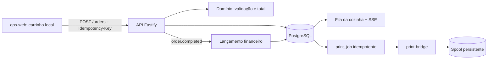

# Arquitetura do Sistema

`service_tabs` é o agregado comercial de consumo local. `orders` permanece o núcleo operacional e representa cada rodada enviada à cozinha; o vínculo é opcional para preservar os quatro canais externos. O frontend reutiliza o mesmo carrinho e apenas troca o endpoint de confirmação quando existe comanda ativa.

`stock_balances` guarda o estado mínimo das três categorias e `stock_movements` guarda a trilha append-only. A baixa faz parte da mesma transação que cria `orders` e `print_jobs`, portanto a cozinha nunca recebe ticket de item sem saldo confirmado.

## Apps

- `apps/api`: núcleo HTTP, domínio, persistência, SSE e automações
- `apps/ops-web`: interface operacional leve
- `apps/print-bridge`: bridge de impressão com spool em arquivo
- `apps/event-simulator`: semeador opcional para demo

## Packages

- `packages/shared-types`: enums e contratos compartilhados
- `packages/domain`: regras e transições de pedido e caixa
- `packages/finance-core`: lançamentos e agregações financeiras

## Infra

- `docker compose`
- PostgreSQL
- volume de spool para impressão

## Decisões

- núcleo único de pedidos
- frontend estático e leve
- backend em Node com Fastify
- finance gerencial e dirigido por evento
- adapters de canal preparados, mas não obrigatórios na v1

## Fluxo operacional obrigatório

- `Finalizar pedido` não limpa o carrinho antes de a API confirmar sucesso. Repetir a mesma finalização deve devolver o mesmo pedido, sem duplicar itens, impressão ou lançamento financeiro.
- O frontend não envia nem exibe operador: a v1 é de posto único, sem login e sem identidade administrativa.
- `fulfillment` aceita apenas `delivery`, `pickup` e `local`. Endereço é obrigatório somente para `delivery` e deve ser ocultado/ignorado nos demais modos.
- A cozinha recebe somente pedidos confirmados. O horário impresso é o `createdAt` persistido no pedido, nunca o horário local da impressora.

## Caixa

- A API é a fonte de verdade do estado do caixa: `closed -> open -> closed`.
- Abrir quando já existe caixa aberto e fechar caixa fechado são conflitos de estado; a UI apenas reflete essa regra e desabilita ações inválidas.
- Reforço e sangria são ajustes de um caixa aberto. O formulário pode ser um diálogo acionado por `Adicionar movimentação`; não constitui um módulo próprio.

## Fronteiras e seams

- `apps/ops-web`: mantém somente estado efêmero de formulário/carrinho e apresenta estados vindos da API.
- `apps/api`: controla idempotência, transações, estado do caixa, confirmação e emissão de eventos.
- `packages/domain`: valida estados e invariantes puras de pedido e caixa.
- `packages/finance-core`: deriva lançamentos de eventos confirmados, sem depender da interface.
- `apps/print-bridge`: recebe o contrato estável do ticket e grava spool idempotente por `jobId`, sem consultar ou alterar pedidos. A API recupera jobs interrompidos na inicialização e repete falhas periodicamente.
- Novos canais entram por adapters que normalizam para o mesmo comando de pedido; não criam fluxos paralelos na UI ou no domínio.

## Eventos internos

- `order.created`, `order.confirmed`, `order.completed`, `order.cancelled`
- `ticket.printed`, `ticket.print.failed`
- `cash.shift.opened`, `cash.adjustment.created`, `cash.shift.closed`
- `finance.entry.created`

## Riscos arquiteturais

- Finalização dividida em várias chamadas do frontend pode deixar pedido persistido sem confirmação/cozinha; a operação deve ser atômica na API.
- Confiar no estado do caixa mantido pela UI permite abertura duplicada e fechamento inválido; a restrição deve ser transacional no backend/DB.
- Gerar horário no print-bridge causa divergência entre operação e ticket; `createdAt` deve atravessar o contrato sem recomputação.
- Acoplar regras de delivery ou canal aos componentes visuais multiplica exceções; a UI coleta dados e a API valida o contrato normalizado.
