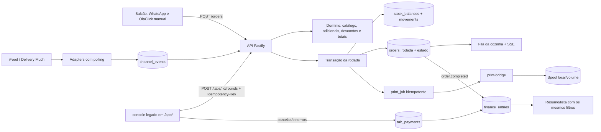

# Arquitetura do Sistema — Camoburguer Demo

> Contrato de fronteiras e decisões arquiteturais da demo. Em caso de divergência
> entre este documento e o código, prevalece o código testado — abrir issue e
> corrigir o documento. Atualizar este arquivo antes de qualquer mudança
> estrutural de módulo, tabela ou evento.

---

# Guia de uso

## Fluxo operacional obrigatório

```mermaid
flowchart LR
  MANUAL["Balcão, WhatsApp e OlaClick manual"] -->|"POST /orders"| API["API Fastify"]
  CHANNELS["iFood / Delivery Much"] --> ADAPTERS["Adapters com polling"]
  ADAPTERS --> EVENTS[("channel_events")]
  EVENTS --> API
  UI["console legado em /app/"] -->|"POST /tabs/:id/rounds + Idempotency-Key"| API
  API --> DOMAIN["Domínio: catálogo, adicionais, descontos e totais"]
  API --> TX["Transação da rodada"]
  TX --> STOCK[("stock_balances + movements")]
  TX --> ORDERS[("orders: rodada + estado")]
  TX --> JOB["print_job idempotente"]
  ORDERS --> KITCHEN["Fila da cozinha + SSE"]
  JOB --> BRIDGE["print-bridge"]
  BRIDGE --> SPOOL[("Spool local/volume")]
  UI -->|"parcelas/estornos"| PAYMENTS[("tab_payments")]
  PAYMENTS --> FINANCE[("finance_entries")]
  ORDERS -->|"order.completed"| FINANCE
  FINANCE --> SUMMARY["Resumo/lista com os mesmos filtros"]
```

## Modelo de persistência consolidado

| Agregado/tabela | Responsabilidade | Regra de integridade principal |
|---|---|---|
| `service_tabs` | identidade e ciclo comercial de comanda/mesa | um identificador normalizado por comanda aberta |
| `orders` | rodada de produção ou cancelamento | número sequencial por comanda e linhas estáveis |
| `stock_balances` | saldo corrente das três categorias | quantidade nunca negativa |
| `stock_movements` | auditoria de carga, ajuste, venda e reversão | efeito idempotente e vínculo ao pedido quando aplicável |
| `tab_payments` | parcelas e compensações em centavos | valor positivo, saldo não excedido e original preservado |
| `finance_entries` | livro gerencial de venda, caixa e pagamento | vínculo opcional a comanda/parcela e lançamento append-only |
| `print_jobs` | entrega recuperável do ticket | um job por efeito e spool idempotente |
| `catalog_items` | catálogo operacional derivado do snapshot base | SKU imutável, arquivamento lógico e classificação de preparo |
| `order_tab_assignments` | auditoria do vínculo tardio | uma atribuição por pedido e chave idempotente global |
| `channel_events` | deduplicação do evento bruto do parceiro | unicidade canal/evento |
| `channel_mappings` | vínculo merchant/pedido externo ao order local | unicidade canal/merchant/pedido |
| `channel_commands` | outbox de aceite, cancelamento, preparo e pronto | estado da máquina + expiração do lease |
| `users` | identidade de administrador e operador (id, name, email, role) | criação única por bootstrap e roles estritas |
| `auth_sessions` | sessões HTTP com expiração | vínculo a usuário e revogação explícita |

## Apps

- **`apps/api`** — núcleo HTTP, domínio, persistência, SSE e automações
- **`apps/ops-web-legacy`** — interface operacional publicada em `/app/`
- **`apps/print-bridge`** — bridge de impressão com spool em arquivo
- **`apps/event-simulator`** — cenário HTTP autenticado e restrito a ambiente local/efêmero

## Packages

- **`packages/shared-types`** — enums e contratos compartilhados
- **`packages/domain`** — regras e transições de pedido e caixa
- **`packages/finance-core`** — lançamentos e agregações financeiras

## Infra

- `docker compose` — orquestração local
- PostgreSQL 16 — dados da demo
- Volume de spool — persistência de print jobs

---

# Guia de desenvolvimento

## Fronteiras e seams

- **`apps/ops-web-legacy`** — mantém o estado efêmero da interface operacional e
  apresenta estados vindos da API. Não duplica regra de negócio.
- **`apps/api`** — controla idempotência, transações, estado do caixa,
  confirmação e emissão de eventos.
- **`packages/domain`** — valida estados e invariantes puras de pedido e caixa.
- **`packages/finance-core`** — deriva lançamentos de eventos confirmados, sem
  depender da interface.
- **`apps/print-bridge`** — recebe o contrato estável do ticket e grava spool
  idempotente por `jobId`, sem consultar ou alterar pedidos. A API recupera jobs
  interrompidos na inicialização e repete falhas periodicamente.
- Novos canais entram por adapters que normalizam para o mesmo comando de pedido;
  não criam fluxos paralelos na UI ou no domínio.

## Decisões arquiteturais

- **Bloco 2 — persistência versionada:** substituir o DDL inline por migrations SQL
  executadas por um único runner com ledger, checksum e lock. Manter adoção de
  bancos existentes sem apagar dados. O rollback destrutivo inicial só pode ser
  exercitado em banco efêmero vazio de teste. Contratos e evidências em
  [execucao-bloco-2.md](execucao-bloco-2.md).
- **Retenção:** execução diária separada do request operacional, com dry-run,
  seleção por pedido entregue antigo, preservação de valores/vínculos/hashes e
  recuperação de limpeza de spool; não equivale a apagar backups.
  `orders.completed_at` registra a primeira passagem por `completed` no banco,
  inclusive para adapters; repetição ou cancelamento posterior não muda o relógio.
  Legado já concluído recebe `GREATEST(created_at, updated_at)` como aproximação
  conservadora explicitamente inferida; não inventar entrega para cancelados sem
  histórico. `privacy_anonymized_at` registra a aplicação da política sem apagar
  o pedido. A migration inicial continua imutável; a evolução usa versão nova.
  Invariantes: não antecipar entrega com timestamp fornecido pelo cliente, não
  reiniciar retenção em replays, não alterar IDs, hashes, parcelas ou totais.

- **Núcleo único de pedidos** — `orders` é o único agregado operacional; comanda
  é coleção comercial de rodadas.
- **Frontend estático e leve** — sem React no fluxo principal do console legado.
- **Backend em Node com Fastify** — validação de domínio, transações e erro público
  sanitizado.
- **Finance gerencial dirigido por evento** — sem fiscal, ficha técnica ou CMV.
- **Adapters iFood/Delivery Much atrás de feature flags** — dependentes de
  homologação antes de habilitar.

## Outbox de integrações

Comandos externos são persistidos antes do HTTP. Workers fazem claim com
`FOR UPDATE SKIP LOCKED`, `lease_owner` e expiração; o HTTP ocorre fora da
transação. Máquina de estados: `pending → processing → awaiting_event/completed`,
com `ambiguous` para resultado possivelmente aplicado e `dead_letter` após três
reconciliações inconclusivas.

- **Trava:** só uma prova explícita `not_applied` permite novo envio; respostas
  HTTP, inclusive 401, exigem reconciliação antes de reenviar.
- **Pendente (antes de produção):** separar claim/outbox, chamada HTTP e
  finalização. Ver gates em [deploy-e-infraestrutura.md](deploy-e-infraestrutura.md).

## Fronteira de integração externa

- `channel_events` deduplica o evento bruto do parceiro.
- `channel_mappings` liga merchant/pedido externo ao único `order` local.
- `channel_commands` funciona como outbox de aceite, cancelamento, preparo e pronto.
- O poller usa advisory lock por canal para evitar duas execuções simultâneas.
- No iFood, persistência/processamento local fazem commit antes do ACK.
- **Trava:** credenciais e payloads reais ainda não foram homologados. Feature
  flags devem permanecer desligadas fora de sandbox.

## Caixa

- `closed → open → closed` — a API é a fonte de verdade.
- Abrir com caixa já aberto e fechar caixa fechado são conflitos de estado; a UI
  apenas reflete essa regra.
- Reforço e sangria são ajustes de um caixa aberto via botão "Adicionar
  movimentação".

## Eventos internos publicados

- `order.created`, `order.confirmed`, `order.completed`, `order.cancelled`
- `order.tab.assigned`
- `catalog.changed` (`created`, `updated`, `paused`, `archived`)
- `ticket.printed`, `ticket.print.failed`
- `cash.shift.opened`, `cash.adjustment.created`, `cash.shift.closed`
- `finance.entry.created`

## Riscos arquiteturais conhecidos

| Risco | Mitigação atual | Estado |
|---|---|---|
| API sem autenticação de operador | CORS/rate limit não substituem auth | **Aberto — gate P0** |
| Finalização dividida em várias chamadas pode deixar pedido sem confirmação | operação deve ser atômica na API | Documentado |
| Confiar em estado de caixa mantido pela UI permite abertura duplicada | restrição transacional no backend/DB | Implementado |
| Bridge hospedado no Render não alcança a impressora da LAN | agente local autenticado exigido | **Aberto — gate P0** |
| Schema no boot dificulta rollback e revisão de migration | migrations versionadas são gate de produção | **Aberto — gate P1** |

## Ver também

[00-mapa-do-projeto.md](../00-mapa-do-projeto.md) ·
[contexto-operacional.md](contexto-operacional.md) ·
[ciclo-do-pedido.md](ciclo-do-pedido.md) ·
[canais-e-captura.md](canais-e-captura.md) ·
[guia-de-desenvolvimento.md](guia-de-desenvolvimento.md)
